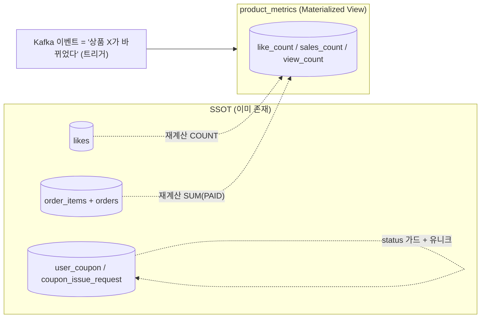
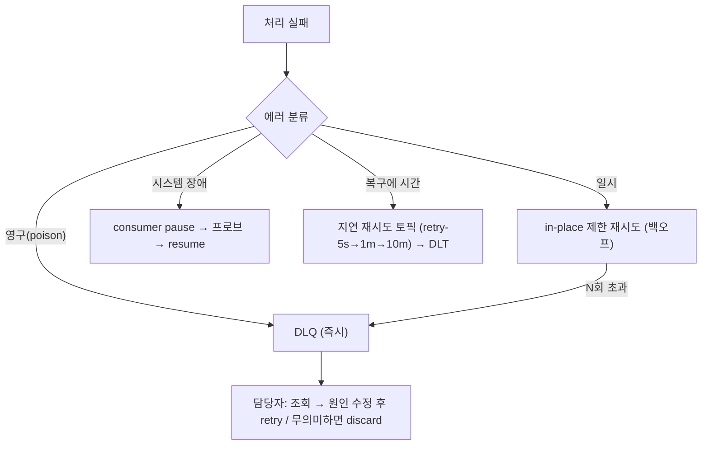

# Week7 설계 — 멱등성·DLQ (재설계)

> 2026-07-01 · feature/week7-event-kafka
> 앞선 구현(event_handled 기반 멱등 + raw DLT) 위에서, **멱등을 설계에 녹이는 방향**과 **실무형 DLQ 운영**으로 재설계한다.

---

## 0. 두 축 요약

| 축 | 결정 |
|---|---|
| **멱등** | 범용 dedup 테이블(`event_handled`) 제거. 각 집계를 **연산 자체가 멱등이 되도록** 설계 |
| **DLQ** | DLQ는 "재시도 장치"가 아니라 **종착지**. 실패를 분류해 재시도/일시정지/DLQ를 나눔 |

---

## 1. 멱등: "기억하지 말고, 설계로 멱등하게"

### 1.1 문제 인식

증분(`count += n`)은 멱등이 아니다 → "이미 셌나"를 **기억**해야 하고, 그래서 `event_handled` 같은 dedup 테이블이 생긴다. 그런데:
- `event_handled` = 모든 메시지마다 쌓이는 **무한 증가 테이블** (TTL·정리 부담)
- fact 테이블(product_sales/like)로 바꾸면 → 테이블이 **오히려 늘어남**

→ 근본 해법은 dedup 저장이 아니라, **연산을 멱등하게 설계**하는 것.

### 1.2 판별 기준 — "카운트 뒤에 식별 가능한 실체가 있나?"

`+1` 자체엔 정체성이 없다(둘을 구별 못 함). 하지만 그 카운트가 **식별 키를 가진 실체에서 파생**되면, 그 키가 곧 멱등 키가 된다.

| 집계 | 뒤의 실체(SSOT) | 자연 키 | 멱등 가능? |
|---|---|---|---|
| 좋아요 | `likes(user_id, product_id)` | 있음 | ✅ 그 키로 |
| 판매량 | `order_items(order_id, product_id)` + `orders.status` | 있음 | ✅ 그 키로 |
| 쿠폰발급 | `user_coupon(coupon_id, user_id)` | 있음 | ✅ 그 키로 |
| **조회** | 없음(같은 유저가 반복, 각각 셈) | **없음** | ❌ → 근사 허용 |

### 1.3 핵심 원칙 — 유니크 키는 producer·consumer **양쪽**에서 쓴다

- **producer 유니크 키**: 비즈니스 중복(더블클릭 등) 차단 → 중복 이벤트 자체가 발행 안 됨.
- 그러나 **인프라 중복(릴레이 재시도·리밸런싱 재전달)** 은 못 막는다 — *하나의* 정상 이벤트가 consumer에 **두 번** 갈 수 있음.
- 그래서 **consumer도 같은 키/실체 기준으로 적용**해야 완성:

| consumer 방식 | 키 사용 | 이중 전달 시 |
|---|---|---|
| `count += 1` (델타) | ❌ | 이중 카운트 ❌ |
| `COUNT(SSOT)` 재계산 / 결과값 덮어쓰기 | ✅ | 두 번 처리해도 동일 ✅ |

### 1.4 케이스별 설계

**① 쿠폰** — 새 테이블 0, dedup 0
- 멱등: `coupon_issue_request.status != PENDING` 이면 skip (요청 행 자체가 가드).
- 수량: **원자적 조건부 차감** `UPDATE coupon SET issued_count = issued_count + 1 WHERE id=? AND (quantity IS NULL OR issued_count < quantity)` → 영향행 0 = 소진. (파티션 직렬화에 의존 안 함)
- 중복 발급: `(coupon_id, user_id)` 유니크가 최종 방어선.
- **판정 도메인화**: `CouponIssuancePolicy`(순수) — NOT_FOUND / DUPLICATE / PROCEED. 인프라 목 없이 단위 테스트.

**② 좋아요** — 재계산
- consumer: `like_count = COUNT(likes WHERE product_id AND deleted_at IS NULL)` → `product_metrics` 덮어쓰기.
- 두 번 처리해도 같은 값(재계산) → 멱등. dedup 테이블 불필요.

**③ 판매량** — 재계산
- consumer: `sales_count = SUM(order_items.quantity) FROM order_items JOIN orders WHERE product_id AND orders.status = PAID`.
- `(order_id, product_id)`는 "제약"이 아니라 "SUM의 식별 단위". 재구매(다른 order_id)·중복 라인과 무관하게 항상 진실 반영 → 멱등.

**④ 조회** — 근사 허용
- SSOT가 없고(개별 조회 저장 안 함) + 소프트 지표 → best-effort 증분. 멱등 강제 안 함(재전달 시 미세 오차 수용).

### 1.5 성능 — 지금은 단순 재계산 (YAGNI)

- 현재 규모: `COUNT/SUM`은 인덱스 있으면 sub-ms. 이벤트 빈도 낮음 → **성능 문제 없음**.
- 나중에 인기 상품 부하가 보이면 **배치 dedup**: 이미 batch listener라 `records.stream().map(productId).distinct().forEach(재계산)` **3줄**이면 됨(새 인프라 없음).
- 극단적이면 **증분 + 주기 reconcile**(핫패스는 증분, 주기적으로 SSOT 재집계로 교정) — `ProductLikeCountReconciler` 패턴이 이미 있음.

### 1.6 두 read-model 병행 (통합 X, CQRS)

같은 SSOT(`likes`/`order_items`)를 **용도 다른 두 투영**으로 둔다. 통합하지 않는다.

| read-model | 소유 | 용도 | 신선도 |
|---|---|---|---|
| `products.like_count` | commerce-api | **운영**: 상세 표시 + **인기순 정렬**(`idx_products_like_count`) | fresh(동기) |
| `product_metrics(like/sales/view)` | commerce-streamer | **분석**: 집계·대시보드 | eventual(Kafka) |

- **`products.like_count` 유지 이유**: 상품 목록 **인기순 정렬**이 products 인덱스를 타야 함. product_metrics로 옮기면 JOIN+filesort로 느려짐. (운영 counter를 co-located로 남기는 유일하고 진짜인 이유)
- **product_metrics는 3지표 모두(like·sales·view)**: like도 통계 관점에서 필요하므로 포함(Quest 요구). products.like_count와 값이 겹치지만 **성격이 다른 read-model**(운영 vs 분석)이라 의도된 중복.
- → operational counter(products)가 남으므로 "eventual 서빙·streamer 운영승격" 문제는 **발생하지 않음**.

---

## 2. DLQ — 실무형 운영

### 2.1 DLQ는 "재시도 장치"가 아니라 "종착지"

재시도 여부 판단은 **DLQ 이전**에 끝난다. DLQ는 *자동 복구를 포기한* 최종 상태.

### 2.2 실패를 분류한다 (무조건 재시도 금지)

| 실패 유형 | 재시도 | 처리 |
|---|---|---|
| **영구(poison)** 역직렬화·스키마·검증 실패 | ❌ | 즉시 DLQ |
| **일시(transient)** 데드락·lock timeout·순간 blip | ✅ 제한적(백오프 N회) | 초과 시 DLQ |
| **의존성 장애(systemic)** 외부서비스·DB 다운(기간 미상) | ⚠️ blind 금지 | pause 또는 지연 재시도 토픽 |

### 2.3 의존성 장애가 특수한 이유

blind 재시도 → 재시도 폭풍(죽은 서비스 계속 두드림) + 파티션 블록 + `max.poll.interval` 초과로 리밸런싱. 전부 DLQ → DLQ 범람(정상 메시지들). **둘 다 안티패턴.**

### 2.4 도메인별로 전략이 갈린다

| 도메인 특성 | 갈림 |
|---|---|
| **순서 민감**(이벤트 소싱) | 지연 재시도 토픽 ❌(순서 깨짐) → pause |
| **외부 의존 많음**(결제) | CB + pause 필수, 함부로 DLQ 안 함 |
| **멱등·지연 허용**(분석·알림) | 공격적/지연 재시도 OK |
| **정합성 임계**(금전) | 재시도+보정 후 최후에만 DLQ+수동 |

핵심 분별: **"이 메시지 문제(poison→DLQ) vs 세상 문제(outage→pause)".**

### 2.5 실무 도구 (Spring Kafka)

| 필요 | 도구 |
|---|---|
| 분류 + 제한 재시도 + DLT | `DefaultErrorHandler(DeadLetterPublishingRecoverer, ExponentialBackOff)` + `addNotRetryableExceptions(...)` |
| 지연 재시도(논블로킹) | `@RetryableTopic` (retry-Ns 토픽 → DLT) |
| 시스템 장애 | `container.pause()/resume()` + Circuit Breaker |

> 전제: 재시도 = 중복 처리 → **처리가 멱등이어야 안전**. (§1과 직결)

### 2.6 DLQ 운영 (API로 활용)

**DLT 레코드 메타데이터**: 원본 `topic/partition/offset/timestamp`, `exception class/message/stacktrace`, `실패시각`, `시도횟수`.

**저장**: `.DLT` 구독 consumer → `dlq_message` 테이블 적재.
- 컬럼: `id, original_topic, partition, offset, error_class, error_message, payload, headers, status(NEW/RETRIED/DISCARDED), created_at`.
- (event_handled와 다름: **실패 건만** 들어와 저·바운드, 운영 라이프사이클 존재 → 관리 대상)

**관리 API**:
| API | 용도 |
|---|---|
| `GET /api/v1/dlq?topic=&status=&page=` | 목록: 토픽·에러·offset·시각·상태 |
| `GET /api/v1/dlq/{id}` | 상세: payload·헤더·stacktrace |
| `POST /api/v1/dlq/{id}/retry` | 원본 토픽 재발행 + RETRIED (자동 무한재시도 아님, 수동) |
| `POST /api/v1/dlq/{id}/discard` | 폐기 + DISCARDED |

**모니터링**: DLQ depth(=NEW 건수) 알림 → 담당자가 API로 원인 확인 → 수정 후 retry / 무의미하면 discard.

### 2.7 구현 범위 & 현황

| 항목 | 상태 | 구현 |
|---|---|---|
| ① 분류 — poison(역직렬화) 즉시 DLT | ✅ 구현 | consumer 가 역직렬화 실패 시 `DeadLetterPublisher` 로 `<topic>.DLT` 격리(원본 topic/partition/offset/예외클래스·메시지 헤더). 처리 오류는 ack 안 함 → Kafka 재전달(기본) |
| ② `dlq_message` store + 관리 API | ✅ 구현 | `DlqIngestConsumer`(`.*\.DLT` 구독→적재), `DlqService`/`DlqV1Controller`(조회·상세·retry·discard). e2e 통과 |
| 일시 오류 **제한** 재시도(N회 후 DLT) | 🔜 향후 | 지금은 무제한 재전달(기본). `DefaultErrorHandler(BackOff)` + 배치 `BatchListenerFailedException` 로 확장 |
| ③ pause-on-systemic | 🔜 문서 | DB 다운 시 `container.pause()/resume()`. 본 컨슈머는 DB 의존뿐이라 골격/문서로 남김 |

**구현 파일**: `support/dlq/`(DeadLetterPublisher·DlqHeaders·DltKafkaConfig), `dlq/`(DlqMessage·DlqService·DlqIngestConsumer·DlqV1Controller).

---

## 3. Avro / Schema Registry (참고 · 향후)

- **Avro**(포맷) = 서버 불필요. **Schema Registry**(중앙 스키마·호환성) = **별도 서버 1개**(컨테이너, 보통 :8081, 스키마는 `_schemas` 토픽에 저장 → 별도 DB 불필요).
- 현재 인프라에 레지스트리 없음 → **JSON 유지**. Avro는 레지스트리 컨테이너 추가가 전제라 **향후 과제**.
- 비용: 서버 하나 + **운영 의존성 증가**(레지스트리 다운 시 직렬화 영향 → 실무는 HA).

---

## 4. 확인 사항

1. ~~product_metrics 통합~~ → **결정: 통합 X.** `products.like_count`(운영/정렬) 유지 + `product_metrics`(분석, like·sales·view 3개) 병행. §1.6. (확정)
2. **리뷰**: 현재 review 도메인 없음 → 자리(컬럼)만 두고 기능은 향후. (확정)
3. **DLQ 구현 깊이**: pause-on-systemic까지 구현 vs 문서/골격만. **(미정)**

---

## 5. 구현 순서 (제안)

1. **멱등 재설계 A**: 쿠폰(정책+원자차감+status) → 좋아요/판매(재계산) → 조회(근사) → `event_handled` 제거 → 스키마 갱신
2. **DLQ B**: 분류/재시도/DLT → `dlq_message` store + 관리 API
3. (선택) pause-on-systemic, Avro+레지스트리

> A 먼저(멱등에서 event_handled 빠지며 consumer가 바뀜) → 그 위에 B 얹는 게 깔끔.
