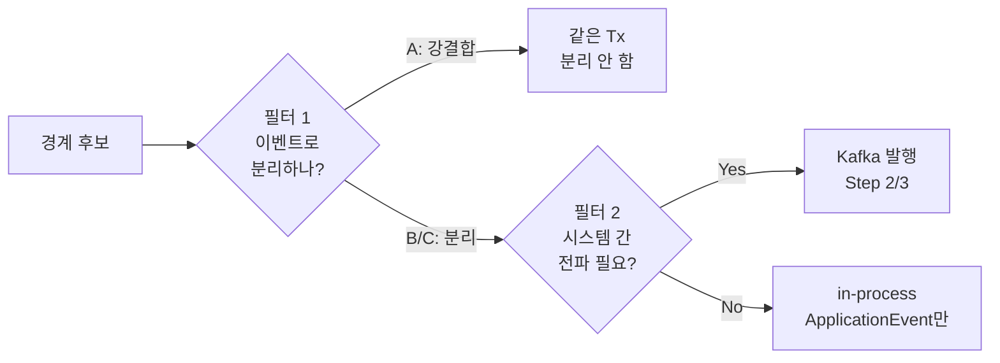
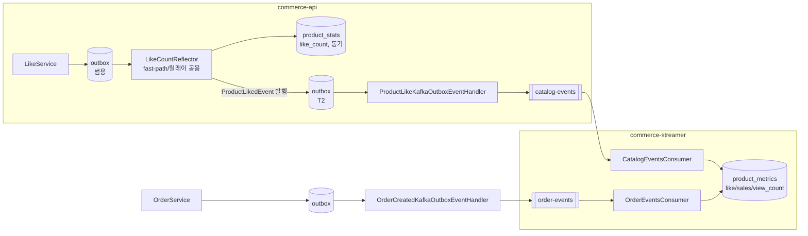
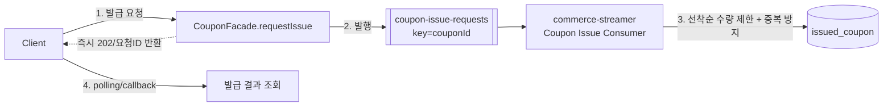

# Round 7 — 체크리스트 기반 이벤트 적용 지점 & 신규 도메인 지도

`round7-quests.md`의 Step 1~3 Checklist를 만족하려면 **어디에** 이벤트를 붙이고 **무엇이 새로** 생기는지를 코드 기준으로 환산한 실행 지도다. "왜 여기에 경계가 있는가"(A/B/C 판단)는 [step1-application-event-boundary.md](./step1-application-event-boundary.md)가 다루고, 이 문서는 그 판단을 **체크리스트 → `file:method` → 신규/기존 → 이벤트·토픽 → 판정**으로 옮긴다.

## 0. 두 개의 필터 — 헷갈리면 여기서 틀린다

경계 후보는 **두 번** 걸러진다. 이 둘을 섞으면 문서가 조용히 틀어진다.



- **필터 1 — 이벤트로 분리하는가?** = step1의 A/B/C. **A(강결합)는 애초에 이벤트가 아니다.** 재고 차감·결제 확정·주문 상태 전환은 같은 트랜잭션에 남는다.
- **필터 2 — Kafka로 보내는가?** = Step 2 Checklist의 첫 항목 "**시스템 간 전파가 필요한 이벤트만** Kafka로." 프로세스 내부에서 끝나는 부가효과는 이벤트로 분리하더라도 **in-process `ApplicationEvent`에 남는다.**

| 이벤트 | 분리? | 전파? | 결론 |
|---|---|---|---|
| 좋아요 수 / 판매량 / 조회수 집계 | B | **Yes** (commerce-streamer가 집계) | **Kafka** |
| 쿠폰 발급 요청 | (재배치) | **Yes** (consumer가 발급) | **Kafka** |
| 유저 행동 로깅 | B or C | **Yes** (streamer가 적재) | **Kafka** |
| 캐시 무효화 | C | **No** (commerce-api 자기 캐시) | **추후 도입 목표로 보류 — 이벤트·리스너 전부 삭제됨(§1.1)** |
| 주문/결제 알림 | C | 정책상 보통 No | in-process(또는 알림 전용 채널) |

> **가장 흔한 실수:** Step 1에서 뽑은 이벤트를 전부 Kafka로 밀어넣는 것. 캐시 무효화는 commerce-api 자기 자신의 Redis를 지우는 일이라 브로커를 탈 이유가 없다. Kafka 대상은 "**다른 시스템(commerce-streamer / 쿠폰 consumer)이 소비해야 하는 사실**"로 한정된다.

---

## 1. Step 1 — ApplicationEvent 경계 분리

Checklist 4항목을 적용 지점으로 환산한다. 상세 판단 근거는 step1 문서 §2 참조.

| # | Checklist | 적용 지점 (`file:method`) | 신규/기존 | 이벤트 | phase / 실행 | 판정 |
|---|---|---|---|---|---|---|
| 1-a | 주문–결제 부가 로직 분리 | `OrderService.create` | **완료** | `OrderCreatedEvent`(§1.1) | outbox 경유 → Kafka(§2) | C(발행 자체) / B(집계 소비) |
| 1-a | 〃 (결제 알림/로깅) | `PaymentFacade.confirmResolved` | **스코프 아님으로 확정** — `round7-quests.md` 체크리스트 4항목엔 없음. 필요해지면 `AFTER_COMMIT` + `ConfirmOutcome.result()` 분기로 추가(step1 §2.2) | `PaymentResultEvent`(가칭, 미구현) | `AFTER_COMMIT` + 결과값 분기 | C |
| 1-b | 좋아요 처리·집계 분리 (집계 실패와 무관하게 좋아요 성공) | `LikeService.register/cancel`(발행) → `OutboxRecordEventListener`(①) → `LikeEventListener.send`(②, fast-path) / `OutboxRelay`→`LikeEventHandler`(③, 릴레이) → `LikeCountReflector.reflect` | **완료** (표준형 ①기록/②fast-path/③릴레이로 재구성, §1.1) | `LikedEvent`/`UnlikedEvent`(T1) | `BEFORE_COMMIT`(①) + `@Async AFTER_COMMIT`(②) + `@Scheduled 1s`(③) | B |
| 1-c | 유저 행동 로깅(조회·클릭·좋아요·주문)을 이벤트로 | `LikeService`/`OrderService`(쓰기 직후), `ProductFacade.getProduct/getProducts`(조회 시) | **완료** | `UserActivityEvent`(마커) 구현체 5종 — `LikedEvent`/`UnlikedEvent`/`OrderCreatedEvent`/`ProductViewedEvent`/`ProductListViewedEvent` | `AFTER_COMMIT`(`fallbackExecution=true`) + `@Async` | C |
| 1-d | 동작 주체 분리 + 트랜잭션 상관관계 | — (전 항목에 phase 매핑으로 충족) | — | — | step1 §3 phase 표 | — |

**현재 구현된 이벤트:** `OrderCreatedEvent`(1-a — `OutboxableEvent`+`UserActivityEvent` 겸용, outbox 통해 Kafka `order-events`로 발행), `LikedEvent`/`UnlikedEvent`(1-b, 좋아요 outbox 표준형의 T1 트리거, 마찬가지로 `UserActivityEvent` 겸용), `ProductLikedEvent`/`ProductUnlikedEvent`(1-b 연장 — 카운트 반영 후 T2 시점에 발행되어 Kafka `catalog-events`로 전파, §1.1·§2.5), `ProductViewedEvent`/`ProductListViewedEvent`(1-c 전용). **캐시 무효화 목적으로 만들었던 이벤트(`ProductCacheEvictEvent`, `BrandDeletedEvent`, `ProductDeletedEvent`, `ProductUpdatedEvent`)는 리스너와 함께 여전히 삭제된 채로 유지**하고 추후 도입 목표로 보류했다(§1.1) — `ProductLikedEvent`/`ProductUnlikedEvent`만 §2.5에서 설명하듯 Kafka 전파 목적으로 다시 만들어졌다. **1-a의 결제 알림은 스코프 아님으로 확정**됐고, **나머지는 전부 완료**됐다.

**결제 실패 알림 주의(step1 §2.2):** `confirm()`의 `FAILED`는 예외가 아니라 **정상 커밋**이다. 따라서 실패 알림도 `AFTER_ROLLBACK`이 아니라 `AFTER_COMMIT` 안에서 `ConfirmOutcome.result()` 값으로 분기한다.

### 1.1 이벤트 경계 리팩터링 경위 — `OrderCreated`/좋아요 outbox는 유지, 캐시 무효화는 전부 삭제

**`createOrder`: command → fact (`OrderCreated`, 완료).** 원래 `createOrder`가 발행하던 `ProductCacheEvictEvent(productIds)`는 **event가 아니라 command에 가까웠다**(step1 §2.1 노트) — 이름이 반응(evict)을 지시하고 publisher가 캐시 정책을 이미 알고 있었다. `domain/order/OrderCreatedEvent`(fact) + `OrderEventPublisher`(포트) + `OrderCoreEventPublisher`(구현)로 전환 완료. 판매량 집계를 별도 이벤트로 새로 만들 필요 없이 `OrderCreated`에 **리스너만 얹으면** 된다(§2.1과 직결).

**좋아요 outbox: 표준형(①/②/③)으로 재구성 (완료), 도메인 무관 범용 Outbox로 한 번 더 일반화됨.** `LikeService.register/cancel`이 도메인 쓰기 직후 `LikedEvent`/`UnlikedEvent(eventId, userId, productId)`를 발행(Facade가 아니라 domain Service에서 — §1.2 원칙 4) → `interfaces/event/outbox/OutboxRecordEventListener.record(OutboxableEvent)`(`BEFORE_COMMIT`, ①)가 outbox에 기록. 이 리스너는 Like를 알지 못한다 — `OutboxableEvent`를 구현하는 이벤트라면 어떤 도메인이든 같은 메서드 하나로 받는다. → `interfaces/event/like/LikeEventListener.send()`(`@Async AFTER_COMMIT`, ②)가 `LikeCountReflector.reflect()`를 즉시 호출(fast-path) → `application/outbox/OutboxRelay`(`@Scheduled 1s`, ③)가 PENDING outbox를 찾아 `eventType`으로 `OutboxEventHandler` 구현체(`application/like/LikeEventHandler`)에 위임해 같은 `reflect()`를 호출한다. `markDoneIfPending`으로 멱등이라 ②·③이 겹쳐도 안전. `LikeCountReflector.reflect()`는 카운트 반영(`ProductStatsService`) 직후 같은 트랜잭션에서 `ProductLikedEvent`/`ProductUnlikedEvent`(T2)를 새로 발행하고, 이게 다시 `OutboxRecordEventListener`를 거쳐 outbox에 쌓였다가 `OutboxRelay`→`ProductLikeKafkaOutboxEventHandler`(§2.5)를 통해 Kafka로 전파된다. 좋아요 하나가 outbox row 2개(T1 in-JVM 반영용, T2 Kafka 전파용)를 만드는 구조다.

**캐시 무효화 이벤트·리스너: 전부 삭제, 추후 도입 목표로 보류 (판단 두 차례 번복).** 경위:
1. `deleteBrand`/`deleteProduct`/`updateProductForAdmin`은 캐시 무효화가 유일 반응이라 공용 `ProductCacheEvictEvent`(command) 유지로 판단.
2. 논의 끝에 `BrandFacade`가 `product` 패키지 이벤트를 발행하는 도메인 소유권 문제 + command성 이름 문제로, **발행 지점별 fact**(`BrandDeletedEvent`/`ProductDeletedEvent`/`ProductUpdatedEvent`/`ProductLikedEvent`/`ProductUnlikedEvent`)로 전부 전환하고 `ProductCacheEvictEvent` 삭제.
3. 좋아요 쪽에서 "`ProductLikedEvent`를 T1(등록 시점)에 발행할지 T2(카운트 반영 후)에 발행할지" 타이밍 논의가 길어졌고, 캐시 무효화가 지금 당장 필요한 기능이 아니라는 판단 하에 **`ProductCacheEvictListener` 자체를 삭제**.
4. 최종적으로 **캐시 무효화를 위해서만 만들었던 이벤트·포트·구현까지 전부 삭제**(`BrandDeletedEvent`·`BrandEventPublisher`·`BrandCoreEventPublisher`, `ProductDeletedEvent`·`ProductUpdatedEvent`·`ProductEventPublisher`·`ProductCoreEventPublisher`, `ProductLikedEvent`·`ProductUnlikedEvent`). `ProductCacheStore.evictProduct`/`evictAll` 같은 인프라 유틸 자체는 남겨뒀다 — 나중에 재사용 가능. 캐시는 지금 TTL(`PRODUCT_TTL=5분`/`LIST_TTL=30초`)로만 정합성을 회복한다.

**추후 도입 시 주의**: 좋아요는 "눌림"(T1, `LikedEvent`/`UnlikedEvent` 발행 시점)과 "카운트 실제 반영"(T2, `LikeCountReflector.reflect()` 이후)이 다른 시점이다. 캐시는 T2 이후에 지워야 의미가 있으므로, T1에 발행되는 `LikedEvent`/`UnlikedEvent`를 캐시 무효화 트리거로 재사용하지 말 것 — T2에 발행되는 `ProductLikedEvent`/`ProductUnlikedEvent`(§2.5, 현재는 Kafka 전파 전용)를 재사용하는 편이 시점상 맞다.

### 1.2 이벤트 관련 패키지 배치 — `apps/pg-simulator` 기준

이벤트 객체·퍼블리셔·리스너·릴레이의 패키지 위치는 레포의 **`apps/pg-simulator`** 모듈을 표준으로 삼는다(payment 도메인이 이미 이 구조로 구현돼 있다). 헥사고날 + DIP를 그대로 따른다.

| 요소 | 위치 | 성격 | pg-simulator 예시 |
|---|---|---|---|
| **이벤트 객체(fact)** | `domain/<도메인>/` | 도메인 어휘. 과거형 사실 | `domain/payment/PaymentEvent`(`object` + 중첩 `PaymentCreated`/`PaymentHandled` + `from()` 팩토리) |
| **퍼블리셔 포트** | `domain/<도메인>/` | 도메인이 의존하는 추상(port) | `domain/payment/PaymentEventPublisher` (interface) |
| **퍼블리셔 구현** | `infrastructure/<도메인>/` | Spring `ApplicationEventPublisher`를 감싸는 어댑터 | `infrastructure/payment/PaymentCoreEventPublisher` |
| **리스너** | `interfaces/event/<도메인>/` | 인바운드 어댑터. **얇게** — application/domain에 위임 | `interfaces/event/payment/PaymentEventListener` → `PaymentApplicationService` 위임 |
| **릴레이/전송 포트** | `domain/<도메인>/` | 아웃바운드 추상(port) | `domain/payment/PaymentRelay` (interface) |
| **릴레이/전송 구현** | `infrastructure/<도메인>/` | 아웃바운드 어댑터(HTTP/Kafka) | `infrastructure/payment/PaymentCoreRelay` (RestTemplate) |

**세 가지 원칙:**

1. **도메인은 Spring API를 모른다(DIP).** 발행 지점(Facade/도메인 Service)은 도메인 포트 `XxxEventPublisher`를 호출하고, `ApplicationEventPublisher`는 **infra 구현에만** 등장한다.
   > ✅ 완료. `OrderService`는 `OrderEventPublisher`, `LikeService`/`LikeCountReflector`는 `LikeEventPublisher`(`LikedEvent`/`UnlikedEvent`/`ProductLikedEvent`/`ProductUnlikedEvent` 4종) 포트로 발행하고, `ApplicationEventPublisher`는 `infrastructure/order/OrderCoreEventPublisher`·`infrastructure/like/LikeCoreEventPublisher`에만 등장한다. `BrandEventPublisher`/`ProductEventPublisher`(캐시 무효화 전용)는 §1.1에서 이벤트째로 삭제된 채다.
2. **리스너는 얇은 인바운드 어댑터.** `interfaces/event/<도메인>/`에 두고, 이벤트를 풀어 application service/domain service를 호출만 한다. 비즈니스 로직(집계·상태 변경)을 리스너 본문에 두지 않는다.
   > ✅ 완료. outbox 기록은 도메인 무관 `interfaces/event/outbox/OutboxRecordEventListener` 하나로 통합됐고, 좋아요 fast-path(`interfaces/event/like/LikeEventListener`)·유저 행동 로깅(`interfaces/event/activity/UserActivityLogListener`)·조회 이벤트 Kafka 직접 발행(`interfaces/event/product/ProductViewedKafkaEventListener`)은 각자 얇게 application 컴포넌트(`LikeCountReflector` 등)나 인프라(`KafkaTemplate`)에 위임만 한다.
3. **아웃바운드는 infra.** Kafka 발행/HTTP 콜백 같은 전송은 릴레이 포트(domain) + 구현(infra)으로 둔다. 리스너와 한 곳에 섞지 않는다.
   > ✅ 완료. `application/outbox/OutboxRelay`(도메인 서비스, 폴링만 담당)가 `OutboxEventHandler` 구현체에 위임하고, 실제 Kafka 전송은 `infrastructure/kafka/KafkaOutboxPublisher`(+ `KafkaEventEnvelope`/`KafkaEventEnvelopeSerializer`)가 맡는다. `ProductLikeKafkaOutboxEventHandler`/`OrderCreatedKafkaOutboxEventHandler`는 이 퍼블리셔를 얇게 감싸기만 한다.
4. **도메인 이벤트는 도메인 쓰기가 확정되는 지점에서 발행한다 — Facade는 기본적으로 발행하지 않는다.** 여러 도메인을 조합만 하는 Facade가 발행 지점이면, 그 사실이 실제로 언제 확정됐는지가 호출 스택에 묻혀 리스너 phase 선택이 흐려진다.
   > ✅ 완료(원칙), 예외 1건 존재. `LikeService.register/cancel`·`OrderService.create`가 각각 도메인 쓰기 직후 발행한다(과거엔 `LikeFacade`/`OrderFacade`가 발행했으나 이관됨). 단 `ProductViewedEvent`/`ProductListViewedEvent`는 대응하는 도메인 쓰기가 없는 순수 조회 사실이라 `ProductFacade.getProduct/getProducts`가 직접 발행한다 — "그 사실을 확정하는 코드가 발행한다"는 원칙은 유지되고, 조회에는 애초에 위임할 domain Service 쓰기가 없을 뿐이다.

**commerce-api 적용 예 (`OrderCreated`, 실제 구현 기준):**

```
domain/order/
  OrderCreatedEvent                     ← 사실(fact), OutboxableEvent + UserActivityEvent 겸용
  OrderEventPublisher (interface)       ← 퍼블리셔 포트
domain/order/
  OrderService.create()                 ← 도메인 쓰기 직후 이 포트로 발행(원칙 4)
infrastructure/order/
  OrderCoreEventPublisher               ← 포트 구현(Spring ApplicationEventPublisher 래핑)
application/order/
  OrderCreatedKafkaOutboxEventHandler   ← OutboxEventHandler 구현, order-events로 Kafka 발행(릴레이가 위임)
interfaces/event/outbox/
  OutboxRecordEventListener             ← BEFORE_COMMIT 기록(도메인 무관, OrderCreatedEvent도 여기로 들어옴)
```

판매량 집계 자체(반응)는 commerce-api가 아니라 **commerce-streamer의 `OrderEventsConsumer` → `MetricsFacade`**가 담당한다 — commerce-api 쪽엔 별도 집계 리스너가 없다(§2.1).

---

## 2. Step 2 — Kafka 이벤트 파이프라인

### 2.1 집계는 하나가 아니라 셋 — 셋 다 구현 완료

Step 2 목표는 **좋아요 수 · 판매량 · 조회 수** 세 집계를 `product_metrics`로 모으는 것이다. 세 경로 전부 commerce-streamer까지 연결됐다.

| 집계 | 이벤트 발생 지점 (`file:method`) | 상태 | 이벤트 | 토픽 (partition key) |
|---|---|---|---|---|
| 좋아요 수 | `LikeCountReflector.reflect` (T2, 카운트 반영 직후) | **완료** — in-JVM 반영(`product_stats`)은 유지, Kafka 전파가 추가됨 | `ProductLikedEvent`/`ProductUnlikedEvent`(§2.5) | `catalog-events` (key=`productId`, 순서 보장) |
| 판매량 | `OrderService.create` | **완료** (§1.1: `OrderCreated`에 outbox 핸들러로 통합, 별도 이벤트 불필요) | `OrderCreatedEvent` | `order-events`(key=`orderId`) |
| 조회 수 | `ProductFacade.getProduct` | **완료(단, outbox 미경유)** — 캐시 우선 조회 경로는 트랜잭션이 없어 `BEFORE_COMMIT` 리스너가 발동하지 않으므로, `ProductViewedKafkaEventListener`가 outbox 없이 best-effort로 직접 발행(§2.5 하단) | `ProductViewedEvent` | `catalog-events` (key=`productId`) |

> **세 경로의 신뢰도 수준이 다르다.** 좋아요·판매량은 outbox를 거쳐 at-least-once가 보장되지만, 조회수는 트랜잭션이 없는 캐시 우선 경로라 outbox에 태울 수 없어 순수 best-effort(유실 허용)다. 조회수 집계가 좋아요·판매량보다 손실에 관대해도 되는 성격(C에 가까움, step1 §2.4)이라는 판단과 일치한다.

### 2.2 `product_stats`와 `product_metrics`: 폐기가 아니라 이원화로 결론남

**결정 확정 — `product_stats`는 폐기하지 않고 commerce-api의 로컬 read model로 유지, `product_metrics`는 별도로 둔다.** 상품 조회 응답(`ProductFacade.getProduct/getProducts`)이 좋아요 수를 즉시 보여줘야 하므로, 동기 반영 경로를 없애지 않았다.



정리:
- **좋아요 수는 두 테이블에 이중 저장된다** — `product_stats.like_count`(동기, commerce-api 응답용)와 `product_metrics.like_count`(비동기, Kafka 경유, streamer 소유).
- **판매량·조회수는 `product_metrics`에만 있다** — `product_stats`에는 해당 컬럼 자체가 없다.
- 세 지표(`like_count`/`sales_count`/`view_count`) 전부 **델타(+1/-1) 누적** 방식으로 upsert한다 — `product_metrics` 엔티티 자체엔 증감 메서드를 두지 않고, `INSERT ... ON DUPLICATE KEY UPDATE like_count = like_count + 1`류의 네이티브 쿼리로 원자적으로 처리한다(§2.4 하단 참고).

### 2.3 `event_handled` ≠ 로그 테이블 — `event_handled`만 구현, `event_log`는 아직 없다

퀘스트가 명시적으로 "**왜 이벤트 핸들링 테이블과 로그 테이블을 분리하나**"를 묻는다. 개념은 분리했지만 실제 테이블은 하나만 만들어졌다.

| 테이블 | 목적 | 키 | 성격 | 상태 |
|---|---|---|---|---|
| `event_handled` | **멱등 처리** — 이 event_id를 이미 소비했는가 | `event_id` (PK) | 제어용. row는 "처리됨" 마킹만 | **완료** — commerce-streamer `EventHandledModel`, `markHandled`는 네이티브 `INSERT IGNORE`로 원자적 최초-처리 판정 |
| `event_log` (또는 metrics 원천 로그) | **실제 데이터 적재** — 무슨 일이 언제 일어났나 | auto id | 데이터용. 1-c 유저 행동 로깅이 여기로 | **미구현** — `UserActivityLogListener`는 지금 SLF4J 로깅만 하고 어디에도 적재하지 않는다. 코드 주석에 "Step 2에서 event_log 적재로 대체될 자리"라 명시돼 있으나 아직 그 자리가 비어 있다 |

분리 이유(설계 판단, 여전히 유효): 멱등 체크는 소비 경로의 **뜨거운 조회**(있나/없나)라 작고 빠른 인덱스여야 하고, 로그는 **계속 쌓이는 append-only 데이터**다. 성격·수명·조회 패턴이 달라 한 테이블에 섞으면 멱등 조회가 로그 볼륨에 눌린다. **`event_log` 테이블·consumer 구현이 이 판단을 코드로 증명하는 마지막 조각으로 남아 있다.**

### 2.4 Step 2 Checklist → 구현 지점

| Checklist | 구현 지점 | 상태 |
|---|---|---|
| 시스템 간 전파 이벤트를 Kafka 발행 | commerce-api `modules:kafka` 의존성 추가 + `infrastructure/kafka/KafkaOutboxPublisher`/`ProductViewedKafkaEventListener` | **완료** |
| `acks=all`, `idempotence=true` | `modules/kafka/kafka.yml` producer 블록(`acks: all`, `properties.enable.idempotence: true`) | **완료** |
| Transactional Outbox | 도메인 무관 범용 outbox(`domain/outbox/*`) 재사용 — 좋아요·판매량이 이걸 같이 쓴다. 조회수만 트랜잭션이 없어 outbox를 타지 못하고 best-effort로 예외 처리(§2.1) | **완료**(조회수 제외) |
| PartitionKey 기반 순서 보장 | `KafkaOutboxPublisher.publishAndMarkDone`이 항상 `outbox.getAggregateId()`를 key로 발행(`catalog-events`=productId, `order-events`=orderId) | **완료** |
| Consumer가 metrics 집계 upsert | commerce-streamer `CatalogEventsConsumer`/`OrderEventsConsumer` → `MetricsFacade` → `ProductMetricsModel`(네이티브 `INSERT ... ON DUPLICATE KEY UPDATE`) | **완료** |
| `event_handled` 멱등 처리 | commerce-streamer `EventHandledModel` + `markHandled`(네이티브 `INSERT IGNORE`) | **완료** |
| manual Ack | `modules/kafka` `ack-mode: manual` + consumer가 처리 성공 시에만 `Acknowledgment.acknowledge()` | **완료** |
| `version`/`updated_at` 기준 최신 이벤트만 반영 | — | **미구현(설계로 대체)** — `product_metrics`의 세 지표를 전부 델타(+1/-1) 누적으로 설계해 "이벤트 순서가 바뀌어도 합은 같다"는 근거로 버전 비교 자체를 생략했다. 중복 재전달 방어는 `event_handled` 멱등만으로 충분하다고 판단한 것 — 체크리스트를 문자 그대로 만족시키진 않으므로 리뷰 시 이 대체 근거를 설명할 것 |

### 2.5 좋아요 이벤트: command → fact + 순서 보장 (`ProductLikedEvent`/`ProductUnlikedEvent`, 완료)

> **Step 1에서 한 번 만들었다가 삭제됐던 것을 Step 2에서 다시 만듦 — 계획대로 진행됨.** 캐시 무효화용으로 만들었던 `ProductLikedEvent`/`ProductUnlikedEvent(productId)`는 유일한 소비자였던 캐시 리스너가 보류되며 함께 삭제됐었다(§1.1). Step 2에서 좋아요를 Kafka로 이관하며 같은 이름으로 다시 만들었고, 이번엔 소비자가 commerce-streamer `CatalogEventsConsumer`라 명확하다.

T1 트리거인 `LikedEvent`/`UnlikedEvent`(§1.1)는 Kafka 페이로드로 나가지 않는다. Kafka로 나가는 fact는 `ProductLikedEvent`/`ProductUnlikedEvent`(`domain/like/`, `OutboxableEvent`만 구현 — `UserActivityEvent` 아님)이고, `LikeCountReflector.reflect()`가 `product_stats` 카운트를 실제로 반영한 직후(T2)에 발행한다. `eventId`는 매번 새 UUID로 발급하고 `outboxId` 같은 내부 식별자는 페이로드에 싣지 않는다 — dedup은 `event_handled(event_id)`로 처리한다.

**좋아요 취소가 "순서 보장" 체크리스트 항목의 근거였고, 지금 코드가 그대로 지킨다.** 같은 상품의 `LIKED` → `UNLIKED`가 역순 처리되면 decrease가 increase보다 먼저 반영돼 카운트가 틀어질 수 있었는데, `KafkaOutboxPublisher.publishAndMarkDone`이 항상 `outbox.getAggregateId()`(=`productId`)를 partition key로 발행하므로 같은 상품 이벤트는 같은 파티션에 몰려 순서가 보장된다. 다만 §2.4에서 짚었듯 "버전/최신값 비교"는 순서 보장 + 멱등만으로 충분하다고 보고 구현하지 않았다 — 델타 누적이라 순서가 보장되면 결과가 항상 같다.

패키지 배치는 §1.2를 따른다 — `ProductLikedEvent`/`ProductUnlikedEvent`는 `domain/like/`에, 발행은 기존 `LikeEventPublisher` 포트(`LikeCoreEventPublisher` 구현)를 재사용, Kafka 전송은 `application/like/ProductLikeKafkaOutboxEventHandler`(`OutboxEventHandler` 구현) + `infrastructure/kafka/KafkaOutboxPublisher`가 맡는다.

---

## 3. Step 3 — Kafka 기반 선착순 쿠폰 발급

현재 `CouponFacade.issue`는 **동기 트랜잭션(A)** 이다(수량 차감·중복 방지 정합성). Step 3는 이걸 "**API는 요청만 발행, consumer가 실제 발급**"으로 재배치한다.



| Checklist | 구현 지점 | 신규/기존 |
|---|---|---|
| 발급 요청 API → Kafka 발행(비동기) | `CouponFacade` 신규 `requestIssue` (기존 동기 `issue`는 consumer 내부 로직으로 이전) | **신규/재배치** |
| Consumer 선착순 수량 제한 + 중복 방지 | commerce-streamer 신규 Coupon consumer | **신규** |
| 발급 결과 확인 구조(polling/callback) | 발급 요청 상태 테이블 + 조회 API | **신규** |
| 동시성 테스트 (수량 초과 방지 검증) | consumer 동시성 제어 + 테스트 | **신규** |

**동시성 제어 후보(step1 §2.4 + 기존 인프라):** `IssuedCouponModel`은 이미 `@Version`(낙관 락)과 UK `(coupon_template_id, user_id)`(중복 방지)를 보유. 선착순 수량 제한은 (a) `CouponTemplate`의 잔여 수량 원자적 UPDATE, 또는 (b) `modules:redis`를 이용한 카운터/`DECR` 중 택1 — CLAUDE.md 동시성 전략상 **원자적 UPDATE 우선**.

---

## 4. 유저 행동 로깅이 B와 C를 오가는 이유 (1-c 보충)

step1 §4와 동일 판단: 같은 "행동 로깅"이 요구사항에 따라 갈린다.

- **분석·추천용** → **C** (몇 건 유실 무방, `AFTER_COMMIT` best-effort)
- **감사·컴플라이언스용** → **B** (한 건도 유실 불가, outbox 내구성)

Step 2에서 로그를 Kafka로 전파해 `event_log`에 적재한다면, 그 내구성 수준(at-least-once 여부)이 이 판단을 따라간다.

---

## 5. 신규 추가물 종합표 — "어떤 도메인이 추가되는가"

| 계층/모듈 | 추가물 | 소속 | 용도 | 상태 |
|---|---|---|---|---|
| 엔티티 | `ProductMetricsModel` (`product_metrics`) | commerce-streamer | 좋아요·판매량·조회수 델타 누적 upsert | ✅완료 |
| 엔티티 | `EventHandledModel` (`event_handled`) | commerce-streamer | `event_id` PK 기반 멱등 처리(`INSERT IGNORE`) | ✅완료 |
| 엔티티 | `event_log`(원천 로그) | commerce-streamer | 유저 행동/이벤트 원천 로그 적재 | ❌미구현 — `UserActivityLogListener`는 SLF4J 로깅만(§2.3) |
| 엔티티 | 쿠폰 발급 요청/결과 상태 테이블 | commerce-api or streamer | 발급 결과 polling/callback | ❌미구현(Step 3 착수 전) |
| 이벤트(fact) | `OrderCreatedEvent` | `domain/order/` | 주문 사실 — `OrderService.create`가 발행, 판매량 집계가 여기 outbox 핸들러로 붙음(§1.1) | ✅완료 |
| 이벤트(fact) | `LikedEvent`/`UnlikedEvent` | `domain/like/` | 좋아요 outbox 표준형의 T1 트리거(①기록/②fast-path 발동용), `UserActivityEvent` 겸용(§1.1) | ✅완료 |
| 이벤트(fact) | `ProductLikedEvent`/`ProductUnlikedEvent` | `domain/like/` | T2(카운트 반영 후) 시점 fact, Kafka `catalog-events` 전파 전용(§2.5) | ✅완료(재도입됨) |
| (삭제됨) | `BrandDeletedEvent`/`ProductDeletedEvent`/`ProductUpdatedEvent` | `domain/brand/`, `domain/product/` | 캐시 무효화 전용으로 만들었다가 리스너와 함께 전부 삭제(§1.1) | 삭제 유지, 재도입 목표로 보류 |
| 이벤트(fact) | `PaymentResultEvent`(가칭) | `domain/payment/` | 결제 성공/실패 알림·로깅 | ❌스코프 아님으로 확정 — `round7-quests.md` 체크리스트에 없음 |
| 이벤트(fact) | `UserActivityEvent`(마커) | `domain/` | 유저 행동 로깅 — `LikedEvent`/`UnlikedEvent`/`OrderCreatedEvent`/`ProductViewedEvent`/`ProductListViewedEvent`가 구현 | ✅완료 |
| 이벤트(fact) | `ProductViewedEvent`/`ProductListViewedEvent` | `domain/product/` | 조회수 집계 + 행동 로깅 겸용 | ✅완료(목록조회는 outbox 미경유, §2.1) |
| 계약 | `DomainEvent`(루트 마커) / `OutboxableEvent`/`UserActivityEvent`(각각 확장) | `domain/`, `domain/outbox/` | 이벤트 식별 스펙과 outbox 자격을 분리(§1) | ✅완료 |
| 퍼블리셔 | `XxxEventPublisher` 포트 + `XxxCoreEventPublisher` 구현 | `domain/` + `infrastructure/` | DIP — Spring API를 infra에 숨김(§1.2) | ✅완료 |
| 리스너 | `OutboxRecordEventListener`(범용 기록) · `LikeEventListener`(fast-path) · `UserActivityLogListener` · `ProductViewedKafkaEventListener` | `interfaces/event/<도메인>/` | 얇은 인바운드 어댑터(§1.2) | ✅완료 |
| outbox | 도메인 무관 범용 outbox(`domain/outbox/*`) — 좋아요·판매량이 공유, 조회수만 예외 | commerce-api | at-least-once 발행 | ✅완료 |
| Kafka 인프라 | `KafkaEventEnvelope`/`KafkaEventEnvelopeSerializer`/`KafkaOutboxPublisher` | `infrastructure/kafka/` | outbox→Kafka 발행 공용 어댑터, ack 확인 후 `markDoneIfPending` | ✅완료 |
| 의존성 | `modules:kafka` | **commerce-api** | producer 발행 | ✅완료(추가됨) |
| 설정 | producer `acks=all` / `enable.idempotence=true`, consumer `value-deserializer` 오타 수정 | `modules/kafka/kafka.yml` | At-Least-Once 발행 · consumer 역직렬화 정상화 | ✅완료 |
| consumer | `CatalogEventsConsumer`/`OrderEventsConsumer` → `MetricsFacade` | commerce-streamer | `product_metrics` upsert, manual ack | ✅완료 |
| consumer | Coupon Issue consumer | commerce-streamer | 선착순 발급 | ❌미구현(Step 3) |
| consumer | 행동 로그 consumer | commerce-streamer | `event_log` 적재 | ❌미구현 |
| 토픽 | `catalog-events`(key=productId) / `order-events`(key=orderId) | Kafka | 순서 보장 · 관심사 분리 | ✅완료 |
| 토픽 | `coupon-issue-requests`(key=couponId) | Kafka | 선착순 쿠폰 발급 요청 | ❌미구현(Step 3) |
| streamer 계층 | domain / infrastructure / application / interfaces 4계층 | commerce-streamer | `metrics`/`eventhandled` 도메인 + consumer | ✅완료(스켈레톤 탈피) |

**commerce-streamer는 더 이상 스켈레톤이 아니다** — `product_metrics`/`event_handled` 도메인과 두 consumer(`CatalogEventsConsumer`/`OrderEventsConsumer`)가 domain/infrastructure/application/interfaces 4계층으로 갖춰졌다. 남은 건 Step 3(쿠폰 발급 consumer)과 `event_log` 적재뿐이다. (퀘스트 문서의 `commerce-collector` = 이 레포의 `commerce-streamer`.)

---

## 6. 열린 결정 — 해소된 것과 남은 것

1. ~~`product_stats` 운명~~ — **해결 (§2.2).** 폐기하지 않고 commerce-api 로컬 read model로 유지, `product_metrics`와 이원화.
2. ~~`modules/kafka/kafka.yml` consumer value deserializer 오설정~~ — **해결.** `value-serializer` 오타를 `value-deserializer`로 수정하고 producer에 `acks=all`/`enable.idempotence=true`를 추가했다(§2.4).
3. ~~판매량/조회수 outbox 위치~~ — **해결.** like 전용이 아니라 `domain/outbox/*` 공용 outbox로 일반화해 판매량(`OrderCreatedEvent`)까지 재사용한다. 조회수만 트랜잭션 부재로 예외적으로 outbox를 건너뛴다(§2.1).
4. **Nice-to-Have (여전히 미착수)** — consumer group 분리(관심사별), consumer 배치 처리, DLQ 구성. 필수 체크리스트가 아니라 시간 허락 시 항목.
5. **신규로 남은 것** — Step 3(선착순 쿠폰 Kafka 발급) 전체, `event_log` 적재(§2.3), `PaymentResultEvent`(스코프 아님으로 이미 확정).

---

## 7. 한 줄 요약

- **필터 둘을 분리하라**: "이벤트인가(A/B/C)"와 "Kafka인가(시스템 간 전파)"는 다른 질문이다. 캐시 무효화는 이벤트(C)지만 Kafka가 아니다.
- **집계는 셋(좋아요·판매량·조회수), 셋 다 구현 완료** — `product_metrics`로 모인다. 좋아요는 `product_stats`와 이원화, 조회수만 outbox 없이 best-effort.
- **commerce-streamer는 더 이상 스켈레톤이 아니다**: `product_metrics`·`event_handled` + 두 consumer가 4계층으로 갖춰졌다. `event_log`만 아직 없다.
- **Step 1·2는 완료, Step 3(선착순 쿠폰)은 착수 전**이다. 쿠폰은 여전히 A(동기) — 요청 발행 + consumer 발급으로 재배치하는 작업이 남았고, 선착순 수량 제한은 원자적 UPDATE 우선(step1 §2.4 동시성 전략).
