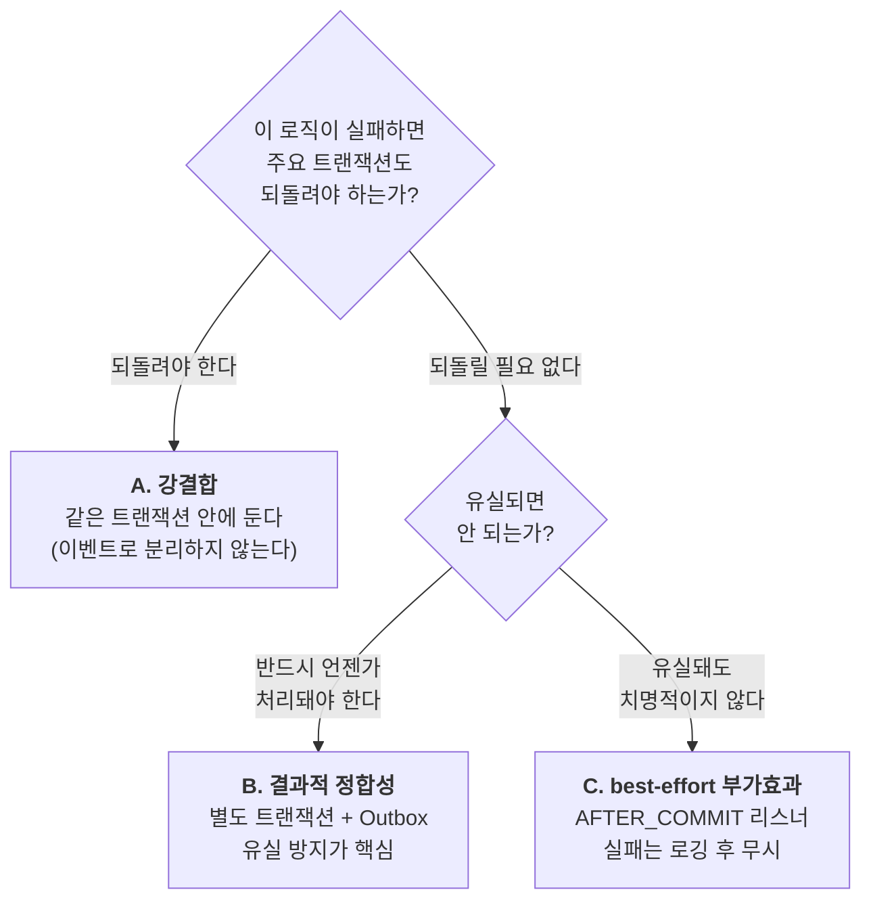
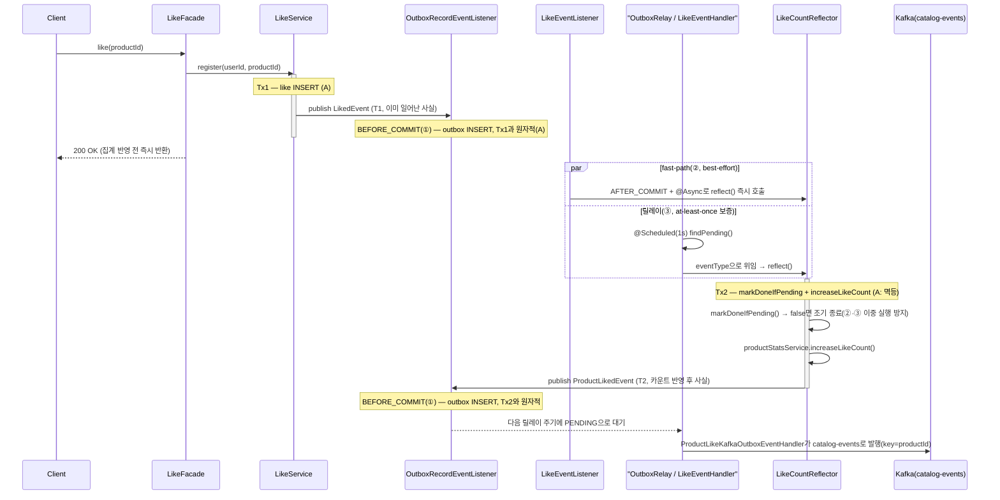

# Step 1 — ApplicationEvent 경계 분리 판단

commerce-api의 전체 도메인에서 "이 로직을 이벤트로 분리해야 하는가?"를 판단한다. 과제가 이름을 댄 주문·결제·좋아요를 중심으로 깊게 보고(§2.1~2.3), 나머지 도메인(brand·coupon·product·user·stock)까지 같은 축으로 훑는다(§2.4). 목표는 이벤트를 최대한 많이 뽑아내는 것이 아니라, **분리해야 하는 것과 분리하면 안 되는 것을 가르는 하나의 기준을 세우고 코드에 적용**하는 것이다.

## 1. 판단 축: 실패 결합도

경계 후보를 만날 때마다 던지는 질문은 하나다.

> **이 로직이 실패하면, 방금 커밋하려는 주요 트랜잭션은 어떻게 되어야 하는가?**

답은 세 갈래로 나뉘고, 이 셋은 "실패가 주요 트랜잭션에 얼마나 강하게 묶여 있는가"라는 단일 스펙트럼 위의 세 지점이다.



- **A. 강결합** — 실패 시 함께 롤백돼야 하는 로직. 재고 차감, 결제 상태 확정, 주문 상태 전환처럼 데이터 정합성이 걸린 것. 이벤트로 분리하면 원자성이 깨진다. → **같은 트랜잭션에 둔다.**
- **B. 결과적 정합성** — 주요 로직 성공을 막지는 않지만 언젠가는 **반드시** 반영돼야 하는 로직. 좋아요 수 집계가 대표적이다. 동기일 필요는 없으나 유실되면 카운트가 영영 틀어진다. → **별도 트랜잭션으로 분리하되 Outbox로 유실을 막는다.**
- **C. best-effort 부가효과** — 실패해도 주요 결과에 영향이 없고 유실도 감수할 수 있는 로직. 캐시 무효화, 알림, 분석용 행동 로깅. → **`@TransactionalEventListener(AFTER_COMMIT)`로 분리하고 실패는 삼킨다.**

이 축은 **경계마다 재귀적으로** 적용된다. 플로우 하나를 통째로 한 번 판정하는 것이 아니라, 플로우 안의 모든 지점에서 같은 질문을 반복한다. 아래 좋아요 플로우가 그 예다 — 하나의 플로우 안에 A·B·C가 모두 들어있다.

한 가지 더: 이벤트로 발행하는 것은 **이미 일어난 사실**(과거형 — "주문이 생성됐다", "좋아요 수가 바뀌었다")이다. publisher는 누가 그것을 소비하는지 몰라도 된다. 이 무지(無知)가 곧 분리가 성립하는 근거다. 반대로 주요 로직이 "그 결과를 반드시 확인해야" 한다면 그건 이벤트가 아니라 명령(command)이고, A에 속한다.

## 2. 현재 코드에 축 적용

### 2.1 주문 생성 — `OrderFacade.createOrder()` + `OrderService.create()`

```java
// OrderFacade.createOrder — 여러 도메인을 조합만 한다, 이벤트는 발행하지 않는다
@Transactional
public OrderInfo createOrder(...) {
    UserModel user = userService.getLoginUser(loginId, loginPw);           // 인증
    Map<Long, ProductModel> productMap = productService.findAllByIdsOrThrow(productIds)...;
    // ... 가격 계산 ...
    if (issuedCouponId != null) {
        issuedCouponService.use(issued.getId());                           // 쿠폰 사용 (UPDATE)
    }
    orderItems.forEach(cmd -> stockService.decreaseStock(...));            // 재고 차감 (UPDATE)
    OrderModel saved = orderService.create(...);                          // 주문 생성 (도메인 서비스에 위임)
    return OrderInfo.from(saved);
}

// OrderService.create — 도메인 쓰기 직후, 같은 도메인 서비스가 사실을 발행한다
public OrderModel create(...) {
    OrderModel saved = orderRepository.save(...);
    eventPublisher.publish(OrderCreatedEvent.from(saved));   // 이미 일어난 사실 발행
    return saved;
}
```

| 로직 | 판정 | 이유 |
|---|---|---|
| 쿠폰 사용 · 재고 차감 · 주문 생성 | **A** | 셋 중 하나라도 실패하면 나머지도 무효여야 한다. 재고는 깎였는데 주문이 없거나, 쿠폰만 소진되면 정합성이 깨진다. 같은 트랜잭션 필수. |
| `OrderCreatedEvent` 발행(사실) | 경계 없음(A 안에서 발행) | 발행 자체는 `@Transactional` 메서드 안에서 호출되지만 **outbox 기록(①)은 `BEFORE_COMMIT`**이라 A와 원자적으로 묶인다 — 아래 §2.3 표준형과 동일 구조를 `OrderCreated`도 그대로 재사용한다(round7-event-application-map.md §1.1). |
| 판매량 집계·상품별 조회 반영 | **B** | `OrderCreatedEvent`가 outbox를 거쳐 Kafka(`order-events`)로 나가고 commerce-streamer가 `product_metrics.sales_count`를 집계한다. 별도 이벤트 없이 `OrderCreated`에 outbox 핸들러(`OrderCreatedKafkaOutboxEventHandler`)만 얹은 형태 — 하나의 사실에 반응이 여럿 달리는 예. |
| 상품 캐시 무효화 | (보류) | 한때 `ProductCacheEvictEvent`(command 형태 — 이름이 반응을 지시하고 publisher가 정책을 알고 있어 §1 기준에 어긋났다)로 구현했다가, 캐시 무효화 자체를 **추후 도입 목표로 보류**하며 이벤트·리스너를 전부 삭제했다(round7-event-application-map.md §1.1). 지금은 `ProductCacheStore`의 TTL(5분/30초)로만 정합성을 회복한다. |
| 주문 완료 알림 | **C** (스코프 아님으로 확정) | 알림 발송이 실패해도 주문은 유효하다. 이번 라운드 체크리스트엔 없어 만들지 않았고, 필요해지면 트랜잭션 안이 아니라 `AFTER_COMMIT` 리스너로 붙인다. |
| 유저 행동 로깅(주문) | **C** (구현됨) | `OrderCreatedEvent`가 `UserActivityEvent`도 함께 구현해 `UserActivityLogListener`가 `AFTER_COMMIT`으로 로깅한다 — 새 이벤트를 만들지 않고 기존 사실에 마커 인터페이스만 얹었다(§2.5 참고). |

**주문 생성은 지금 A(쓰기 3종) 뒤에 하나의 사실(`OrderCreatedEvent`)만 발행하고, 그 사실에 B(판매량 집계)와 C(행동 로깅)가 각각 리스너/outbox 핸들러로 붙는 구조다.** 캐시 무효화만 아직 반응이 없다(의도적 보류). 알림 전송을 트랜잭션 안에서 동기 호출했다면, 알림 서버 지연이 주문 트랜잭션의 커넥션 점유 시간을 늘리고 실패 시 정상 주문까지 롤백시켰을 것이다 — 지금 구조는 그 함정을 피해 있다.

### 2.2 결제 확정 — `PaymentFacade.confirmResolved()`

결제 Facade의 `pay()`는 PG HTTP 호출을 트랜잭션 밖에 두려고 의도적으로 비트랜잭션이다(설계 §4). 반면 확정 경로는 다르다.

```java
// confirm(조건부 UPDATE) + 주문 후처리를 한 트랜잭션으로 묶어
// "결제는 PAID인데 주문은 미확정"인 crash gap을 막는다.
@Transactional
public ConfirmOutcome confirmResolved(...) {
    ConfirmOutcome outcome = paymentService.confirm(...);   // 결제 상태 전이 (조건부 UPDATE)
    applyOrderPostProcessing(outcome);                      // 주문 상태 전환
    return outcome;
}

private void applyOrderPostProcessing(ConfirmOutcome outcome) {
    switch (outcome.result()) {
        case PAID   -> orderService.markPaid(outcome.orderId());
        case FAILED -> orderService.markPaymentFailed(outcome.orderId());
        default     -> { /* SKIPPED / ISOLATED / STILL_PENDING → 후처리 없음 */ }
    }
}
```

| 로직 | 판정 | 이유 |
|---|---|---|
| 결제 상태 확정 + 주문 상태 전환 | **A** | 결제가 PAID로 확정됐는데 주문이 미확정이면 "돈은 빠졌는데 주문 없음"이 된다. 두 상태 전환은 반드시 같은 트랜잭션이어야 한다. 코드 주석의 crash gap 방어가 그 근거다. |
| 결제 성공/실패 알림 · 결제 로깅 | **C** (스코프 아님으로 확정) | 알림·로깅이 실패해도 결제·주문 확정은 유효하다. 이번 라운드 체크리스트 4항목엔 없어 만들지 않기로 확정했다. 필요해지면 `confirmResolved` 안이 아니라 `AFTER_COMMIT` + 결과값 분기 이벤트로 분리한다(아래 참고). |

**핵심 구분 — 비즈니스 실패 ≠ 트랜잭션 롤백.** `confirm()`의 `FAILED` 분기는 예외를 던지지 않는다. `ConfirmOutcome.failed(...)`를 반환하고 `markPaymentFailed`가 실행된 뒤 트랜잭션은 **정상 커밋**된다. 즉 "결제 실패"는 성공적으로 커밋된 결과다. 따라서 결제 실패 알림도 `AFTER_ROLLBACK`이 아니라 **`AFTER_COMMIT`**에 붙는다. 리스너는 커밋된 `ConfirmOutcome.result()`를 보고 성공/실패 메시지를 나눠 보내면 된다. `AFTER_ROLLBACK`은 예상치 못한 예외로 트랜잭션 자체가 깨진 경우에나 해당한다.

### 2.3 좋아요 집계 — Outbox + ApplicationEvent (축이 재귀적으로 적용되는 예)

좋아요 플로우는 판정이 한 흐름 안에 두 번 반복된다 — T1(눌림 자체)에서 한 번, T2(카운트 반영 후)에서 한 번.



| 경계 | 판정 | 이유 |
|---|---|---|
| `LikeService.register()` + outbox 기록(①, `LikedEvent`) | **A** | 좋아요 등록과 outbox 기록이 같은 트랜잭션이어야 이벤트 유실이 없다. 등록은 됐는데 outbox가 없으면 집계가 영영 누락된다. `OutboxRecordEventListener`는 Like를 모른다 — `OutboxableEvent`라면 어떤 도메인이든 같은 메서드로 기록한다. |
| 좋아요 등록(T1) → 좋아요 수 집계(T2) 분리 | **B** | 집계는 좋아요 응답을 막을 필요가 없다(핫 상품에서 카운터 row 경합이 응답 경로에 들어오지 않게). 그러나 유실되면 카운트가 틀어지므로 Outbox로 at-least-once를 보장한다. fast-path(②)가 지연을 없애고, 릴레이(③)가 실패분을 따라잡는다(§3.1). |
| `markDoneIfPending()` + `increaseLikeCount()` (`LikeCountReflector.reflect()` 내부) | **A** | 중복 발행(②·③ 경합)에 대비한 멱등 처리와 실제 카운트 증가가 같은 트랜잭션이어야 한다. `markDoneIfPending`이 `false`면 조기 종료해 이중 반영을 막는다. |
| `ProductLikedEvent`/`ProductUnlikedEvent` 발행 + Kafka 전파(T2) | **B** | 카운트 반영 직후 같은 트랜잭션에서 발행되는 두 번째 사실. `catalog-events`(key=`productId`)로 나가 commerce-streamer가 `product_metrics.like_count`를 집계한다. |
| 캐시 무효화 | (보류) | 2.1과 동일하게 이벤트·리스너를 전부 삭제하고 추후 도입 목표로 보류했다. 재도입 시 T1이 아니라 T2 이후(`ProductLikedEvent`/`ProductUnlikedEvent`)를 구독해야 의미가 있다(round7-event-application-map.md §1.1 "추후 도입 시 주의"). |

**"인프로세스 이벤트 홉을 Step 2에서 Kafka로 대체한다"던 계획이 실제로 이렇게 구현됐다**: T1(`LikedEvent`)은 여전히 in-JVM 반영(`product_stats`)에만 쓰이고, T2(`ProductLikedEvent`)가 새로 생겨 Kafka 전파를 전담한다. 두 이벤트를 하나로 합치지 않은 이유는 **발행 시점에 이미 일어난 사실이 다르기 때문**이다 — T1 시점엔 "눌림"만 사실이고 카운트는 아직 안 바뀌었다.

**좋아요 취소가 필요로 했던 "순서 보장"은 partition key로 실제 방어된다.** 같은 상품에 대한 `LIKED` → `UNLIKED`가 역순으로 처리되면 decrease가 increase보다 먼저 반영돼 카운트가 틀어질 수 있다. `KafkaOutboxPublisher`가 항상 `outbox.getAggregateId()`(=`productId`)를 key로 발행하므로 같은 상품 이벤트는 같은 파티션에 몰려 순서가 보장된다 — 퀘스트 "PartitionKey 기반 이벤트 순서 보장" 항목이 이 경로로 충족됐다. `commerce-streamer`의 `product_metrics`는 `version`/`updated_at` 비교 대신 **델타(+1/-1) 누적**으로 설계해, 순서만 보장되면 버전 비교 없이도 결과가 같아지도록 했다(round7-event-application-map.md §2.4).

### 2.4 나머지 도메인 스윕 (brand · coupon · product 조회 · user · stock)

과제가 이름을 댄 것은 주문·결제·좋아요지만, 요청은 "commerce-api의 이벤트 경계 탐색"이므로 나머지 도메인에도 같은 축을 적용한다. 결론부터: 대부분 A(정합성)라 분리 대상이 아니며, **집계(B) 성격의 미발굴 경계 두 곳**이 Step 2와 직접 맞물린다.

| 도메인 · 지점 | 판정 | 상태 | 설명 |
|---|---|---|---|
| `BrandFacade.deleteBrand` — 브랜드 삭제 + 상품/재고 soft-delete | **A** | 구현됨 | cascade는 원자적이어야 한다(브랜드만 지워지고 상품이 남으면 orphan). 같은 트랜잭션 필수. |
| 위 삭제에 딸린 캐시 무효화 | **C** | **삭제·보류** | 한때 `ProductCacheEvictEvent`로 이벤트 분리했으나, 캐시 무효화 기능 자체를 추후 도입 목표로 보류하며 이벤트·리스너를 전부 삭제했다(round7-event-application-map.md §1.1). 지금은 TTL로만 회복. |
| `ProductFacade.deleteProduct` / `updateProductForAdmin` — 상품 변경 + 캐시 무효화 | **A**(변경) | 변경(A)만 구현됨, 캐시 무효화(C)는 **삭제·보류** | 상품·재고 변경은 A(같은 Tx)로 유지. 캐시 무효화는 위 브랜드 삭제와 같은 이유로 이벤트·리스너가 전부 삭제됐다. `createProductForAdmin`은 캐시할 게 없어 애초에 대상 아님. |
| `ProductFacade.getProduct` — **상품 조회수 집계** | **C**(구현은 outbox 없이 best-effort) | **구현됨** | `product_metrics.view_count` 대상. 조회는 캐시 히트로 끝나야 빠른데, 캐시 우선 경로는 트랜잭션이 없어 outbox(`BEFORE_COMMIT`)를 탈 수 없다. 그래서 `ProductViewedEvent`를 `ProductViewedKafkaEventListener`가 `AFTER_COMMIT`(`fallbackExecution=true`) + `@Async`로 outbox 없이 직접 Kafka 발행한다 — 원래 B로 추정했으나 실제로는 유실을 감수하는 C에 더 가깝게 구현됐다. |
| `OrderService.create` — **상품별 판매량 집계** | **B** | **구현됨** | `product_metrics.sales_count` 대상. `OrderCreatedEvent`에 `OrderCreatedKafkaOutboxEventHandler`(outbox 핸들러)만 얹어 좋아요와 같은 표준형(①outbox 기록/③릴레이)을 재사용한다 — 별도 이벤트를 새로 만들지 않았다. |
| `CouponFacade.issue` — **쿠폰 발급** | 현재 **A** | 구현됨(동기) | 발급 수량 차감·중복 방지가 정합성 핵심이라 지금은 동기 트랜잭션이다. **Step 3에서 "발급 요청"을 Kafka로 던지고 consumer가 실제 발급**하도록 바뀌는 자리다. 발급 성공 알림/로깅이 붙는다면 그건 C. |
| `UserService` 회원가입/로그인 (Facade 없음) | **C** | 미구현 | 가입 환영 알림, 로그인 이력 로깅 등이 붙는다면 best-effort C. 정합성이 걸린 부가 로직은 없다. |
| `StockService` 재고 증감 | **A** | 구현됨 | 독립 플로우가 없다. 항상 주문/상품 트랜잭션 안에서 호출되는 A. 분리 대상 아님. |

**이 스윕에서 드러난 핵심:** Step 2 집계 세 가지(**좋아요 수·판매량·조회 수**) 모두 `product_metrics`로 모이도록 구현이 끝났다. 다만 셋의 신뢰도 수준이 똑같지는 않다 — 좋아요·판매량은 B(Outbox → at-least-once)로 구현됐고, 조회수는 트랜잭션 없는 캐시 우선 경로라는 제약 때문에 C(best-effort, 유실 허용)로 타협됐다. "같은 목적의 집계라도 발행 지점의 트랜잭션 유무에 따라 판정이 갈릴 수 있다"는 것 자체가 §4의 "판단은 코드가 아니라 상황이 정한다"는 원칙의 또 다른 사례다.

## 3. 리스너 phase 선택 — 트랜잭션 결과와의 상관관계

C로 분류된 로직을 붙일 때, 주요 트랜잭션의 결과와 어떻게 연동할지에 따라 phase가 갈린다.

| 방식 | 실행 시점 | 트랜잭션 관계 | 언제 쓰나 | 현재 사용처 |
|---|---|---|---|---|
| `@EventListener` (비트랜잭션 publisher) | publisher 호출 스택에서 동기 실행 | 리스너가 **자기 트랜잭션**을 연다 | 별도 트랜잭션이되 동기 실행이 필요할 때 | — (현재 전부 `@TransactionalEventListener`로 구현됨) |
| `@TransactionalEventListener(BEFORE_COMMIT)` | 커밋 직전, 같은 트랜잭션 | 실패 시 주요 트랜잭션 롤백 | 사실상 A. C에는 부적합 | `OutboxRecordEventListener.record()` — 도메인 무관 outbox 기록(§2.3) |
| `@TransactionalEventListener(AFTER_COMMIT)` | 커밋 성공 후 | 주요 성공에만 뒤따름 | **C의 기본값** — 성공 알림, 캐시 무효화, 포인트 적립 | `LikeEventListener.send()`(fast-path, `@Async`) · `UserActivityLogListener.log()`(`fallbackExecution=true`로 무트랜잭션도 처리) · `ProductViewedKafkaEventListener.send()` |
| `@TransactionalEventListener(AFTER_ROLLBACK)` | 롤백 후 | 주요 실패 시에만 | 트랜잭션이 깨진 경우의 보상·경보 | — (미사용) |
| `@TransactionalEventListener(AFTER_COMPLETION)` | 커밋/롤백 무관 | 결과 무관 | 리소스 정리 등 | — (미사용) |

**규칙:** C의 부가효과는 대부분 `AFTER_COMMIT`이다 — 일어나지 않은 일에 대해 알림을 보내면 안 되기 때문이다. 단 2.2에서 봤듯 "비즈니스 실패"는 트랜잭션 관점에선 커밋이므로, 실패 알림도 `AFTER_ROLLBACK`이 아니라 `AFTER_COMMIT` 안에서 결과 값으로 분기한다. `AFTER_ROLLBACK`은 예외로 트랜잭션이 실제로 깨진 경우에 한정된다.

### 3.1 B를 구현하는 표준 형태 — 비동기 이벤트 발행 + Outbox

B(결과적 정합성)를 새로 구현할 때는 **outbox 기록**과 **실제 발송**을 각각 다른 phase의 리스너로 분리하고, 그 위에 **미발송분을 주워 재전송하는 릴레이**를 둔다. 이 셋이 한 세트다 — 리스너 둘만으로는 at-least-once가 성립하지 않는다.

```java
@Transactional
public XxxInfo doSomething(XxxCommand command) {
    XxxResult result = /* 1. 도메인 로직 */;
    eventService.eventPublish(XxxEventCommand.from(result));   // 2. 인프로세스 이벤트 발행
    return XxxInfo.of(result);
}

// 리스너 ①: outbox 기록 — 주요 트랜잭션과 같은 Tx에 합류 (원자적, 유실 차단)
@TransactionalEventListener(phase = TransactionPhase.BEFORE_COMMIT)
public void record(XxxExternalEvent event) {
    eventRecorder.save(event.toEventRecordCommand());   // status = PENDING
}

// 리스너 ②: 브로커 전송 (fast-path) — 커밋 확정 후 비동기 (best-effort)
@Async(EVENT_ASYNC_TASK_EXECUTOR)
@TransactionalEventListener(phase = TransactionPhase.AFTER_COMMIT)
public void send(XxxExternalEvent event) {
    sendService.send(XxxMessagePayload.from(event));   // 전송 대상은 정책에 따라 다름 (예: Kafka)
    // 성공 시 outbox status = DONE. 실패해도 예외를 삼킨다 — ③이 다시 보낸다.
}

// ③ 릴레이 — outbox의 미발송분을 주기적으로 폴링해 재전송 (at-least-once의 실제 보증자)
@Scheduled(fixedDelay = 1000)
public void relay() {
    eventRecorder.findPending().forEach(record -> {
        sendService.send(record.toMessagePayload());   // 재전송 후 성공하면 DONE 마킹
    });
}
```

이 구조가 축과 맞물리는 지점이 핵심이다. **하나의 B를 세 조각으로 쪼개면 각 조각의 판정이 다르다.**

| 조각 | phase / 실행 | 축 판정 | 이유 |
|---|---|---|---|
| outbox 기록 (①) | `BEFORE_COMMIT` | **A** | 주요 로직과 원자적으로 커밋돼야 유실이 없다. 실패하면 주요 로직도 롤백. **내구성은 여기서 확보된다.** |
| 브로커 전송 (②) | `AFTER_COMMIT` + `@Async` | **C** | 정상 경로의 발송 지연을 줄이는 **fast-path일 뿐**이다. 실패해도 삼킨다 — 내구성은 ①이, 재전송은 ③이 책임진다. |
| 릴레이 (③) | `@Scheduled` 폴링 | — (인프라) | ②가 실패해 outbox에 남은 `PENDING`을 주워 다시 보낸다. **at-least-once를 실제로 보증하는 주체.** ②가 없어도 ③만으로 정합성은 성립하고(폴링 주기만큼 지연될 뿐), ③이 없으면 ②의 실패분이 영영 미발송으로 남아 outbox 패턴이 무너진다. |

즉 "B = 유실되면 안 되는 부분(A)을 outbox로 못박고(①), 정상 경로는 fast-path(C)로 흘려보내되(②), 그 실패분은 릴레이(③)가 반드시 따라잡는다"로 분해된다. 이것이 §1에서 말한 축의 재귀적 적용의 가장 구체적인 형태다.

> **좋아요가 이 표준형의 첫 구현체다.** ① `OutboxRecordEventListener.record()`(도메인 무관, `BEFORE_COMMIT`) — ② `LikeEventListener.send()`(`@Async AFTER_COMMIT` fast-path) — ③ `OutboxRelay`(`@Scheduled(1s)`) + `LikeEventHandler`(`OutboxEventHandler` 구현)로 실제 코드에 그대로 존재한다. ①은 애초부터 도메인을 가리지 않게 지어졌고(`OutboxableEvent`만 구현하면 됨), 그 덕에 **판매량 집계(`OrderCreatedEvent`)가 새 outbox 인프라를 만들지 않고 ①·③을 그대로 재사용**했다 — `OrderCreatedKafkaOutboxEventHandler`만 새로 추가하면 됐다. 전송 대상(in-JVM 반영 vs Kafka 발행)은 `OutboxEventHandler` 구현체가 무엇이냐에 따라 갈린다(round7-event-application-map.md §1.1·§2.1).

## 4. 같은 로직이라도 판정이 달라질 수 있다 — 판단 기준이 학습 포인트인 이유

축은 기계적 규칙이 아니라 **손실 허용도에 대한 비즈니스 판단**을 요구한다. 유저 행동 로깅이 대표적이다.

- **순수 분석·추천용**이라면 → **C**. 몇 건 유실돼도 통계에 유의미한 왜곡이 없다. `AFTER_COMMIT` best-effort로 충분하다.
- **감사·컴플라이언스용**(예: 결제 이력 추적 의무)이라면 → **B**. 한 건도 유실되면 안 되므로 Outbox로 내구성을 확보해야 한다.

동일한 "행동 로깅"이 요구사항에 따라 B와 C를 오간다. 그래서 "이걸 이벤트로 분리해야 하는가?"의 답은 코드만 봐서는 나오지 않고, **그 로직이 실패했을 때 비즈니스가 무엇을 감수할 수 있는지**를 물어야 나온다. 이 판단 자체가 이번 스텝의 학습 목표다.

## 5. 요약

전체 8개 도메인(brand · coupon · like · order · payment · product · stock · user)에 축을 적용한 결과다.

| 플로우 | A (같은 Tx, 분리 금지) | B (Outbox 분리, 집계) | C (AFTER_COMMIT best-effort) |
|---|---|---|---|
| **주문 생성** | 쿠폰 사용 · 재고 차감 · 주문 생성 | 판매량 집계(구현됨 — `OrderCreatedEvent`) | 캐시 무효화(삭제·보류) · 유저 행동 로깅(구현됨) · 주문 알림(스코프 아님) |
| **결제 확정** | 결제 상태 확정 + 주문 상태 전환 | — | 결제 성공/실패 알림 · 로깅(스코프 아님으로 확정) |
| **좋아요** | 등록+outbox 기록 / 멱등처리+카운트 증가(`LikeCountReflector`) | 좋아요 수 집계(구현됨, T1→T2 두 단계) | 유저 행동 로깅(구현됨) · 캐시 무효화(삭제·보류) |
| **상품** | 상품/재고 변경 · 삭제 | 조회수 집계(구현됨, 단 outbox 미경유 best-effort) | 유저 행동 로깅(구현됨) · 캐시 무효화(삭제·보류) |
| **브랜드** | 삭제 cascade(상품·재고 soft-delete) | — | 캐시 무효화(삭제·보류) |
| **쿠폰** | 발급 수량 차감·중복 방지(→ Step 3에서 Kafka로 이전 예정, 아직 착수 전) | — | 발급 알림/로깅(미구현) |
| **유저** | — | — | 가입/로그인 알림·로깅(미구현) |
| **재고** | 주문/상품 Tx 안의 증감 (독립 플로우 없음) | — | — |

- 판단 기준은 하나 — **실패가 주요 트랜잭션을 되돌려야 하는가, 유실을 감수할 수 있는가.**
- 이 질문을 플로우 전체가 아니라 **경계마다 반복**한다. 좋아요 플로우는 그 자체로 A·B·C를 모두 포함하고, T1(등록)·T2(카운트 반영) 두 시점에서 각각 반복된다.
- 결제·쿠폰의 알림·로깅은 이번 라운드 스코프 아님으로 확정했다. 주문·좋아요·상품 조회의 유저 행동 로깅은 `UserActivityEvent`로 이미 구현됐다.
- Step 2가 요구하는 집계 세 가지(**좋아요 수 · 판매량 · 조회 수**)는 모두 `product_metrics`로 모이도록 구현이 끝났다. 좋아요·판매량은 B(outbox 경유), 조회수는 트랜잭션 부재로 C(best-effort)로 타협됐다는 차이만 있다.
- 쿠폰 발급은 여전히 A(동기)다. Step 3(발급 요청을 Kafka로 던지는 비동기 구조로 재배치)는 아직 착수 전이다.
