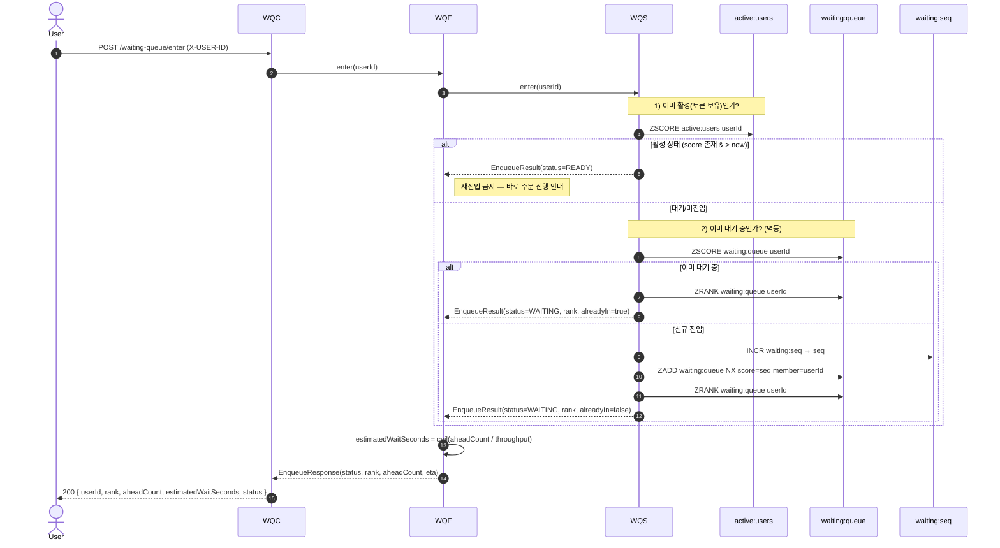
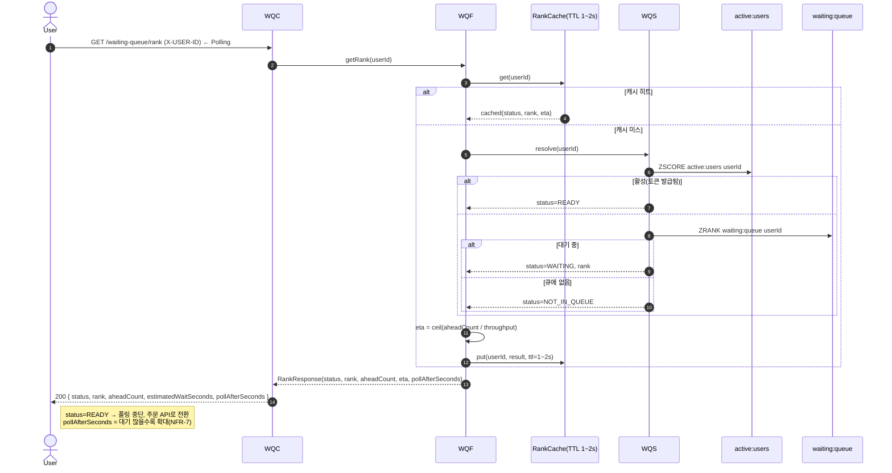
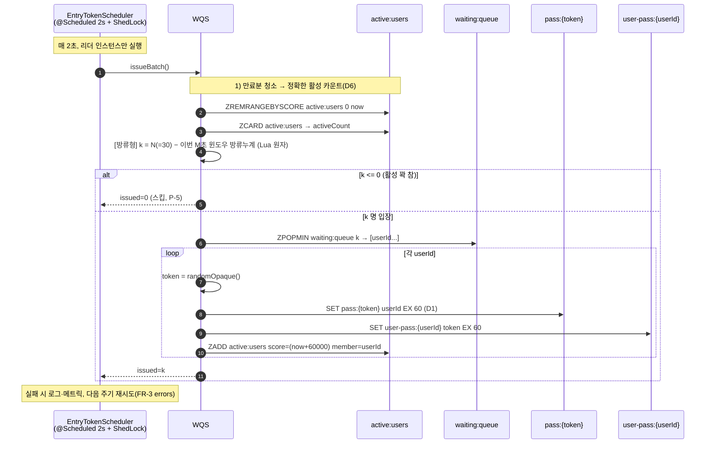
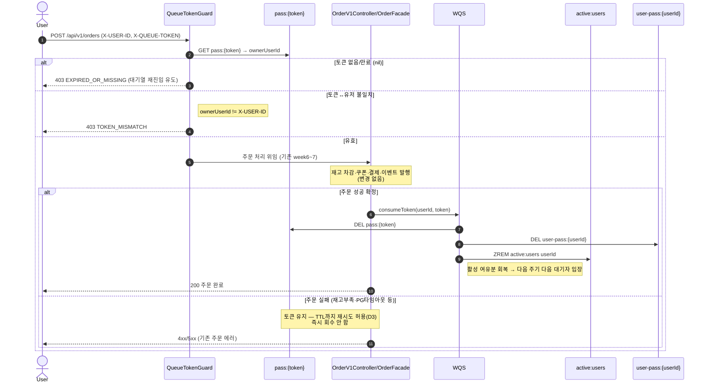
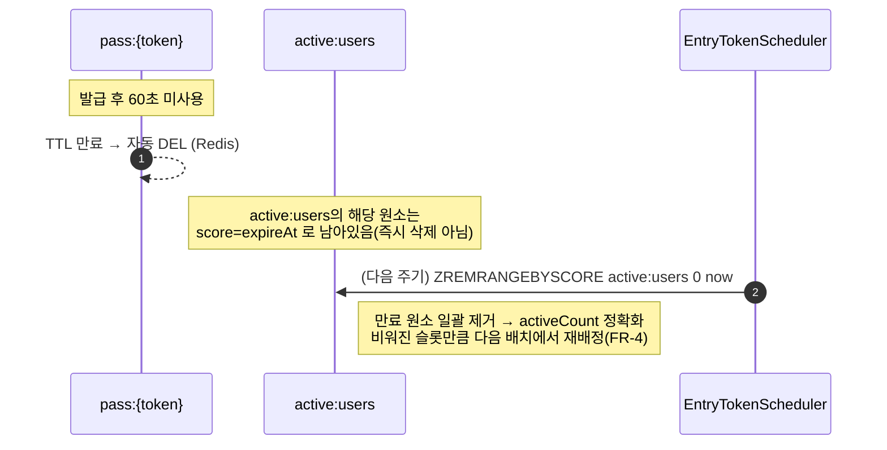
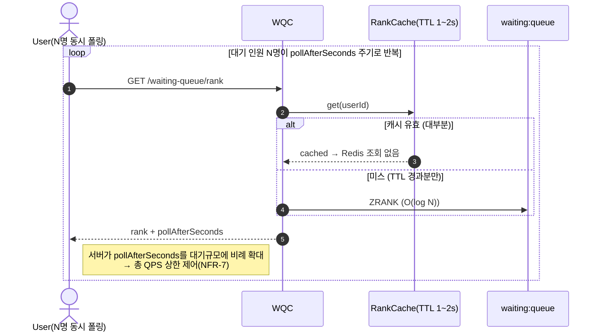
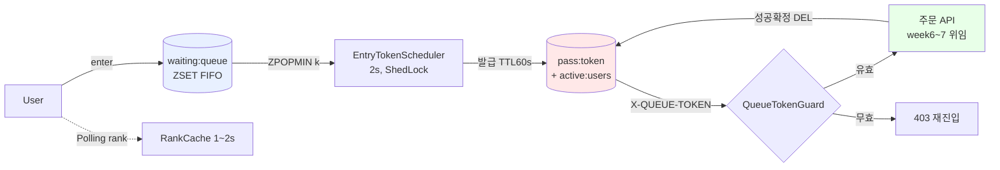

# 02. 시퀀스 다이어그램 — Redis 기반 대기열 (Virtual Waiting Room)

> **⚠️ 2026-07-08 방류형 전환**: 발급(S2-1) 흐름의 `k = min(N_max, maxActive − activeCount)`(정원제 리필)·`ShedLock 단일 실행`은 폐기됐다. 현행은 **방류형 + Lua 윈도우 레이트리밋** — 매 M초 대기열 앞에서 최대 N명 방류, 방류량 = `N − 이번 윈도우 방류누계`(다중 인스턴스 합산 ≤ N), 락 없음. 정설은 [`04-redis-model.md`](./04-redis-model.md) §3.1. 아래 다이어그램의 해당 노트는 구설계다.

[`01-requirements.md`](./01-requirements.md) §6의 Step1~3 흐름을 레이어별 참여자 기준으로 시각화한다. 표기 규칙은 [`../week2/02-sequence-diagrams.md`](../week2/02-sequence-diagrams.md) §0을 따른다(레이어/화살표/생략/공통 에러). 이 문서의 결정 근거는 [`01-requirements.md`](./01-requirements.md) §9 결정사항 표(D1~D9)를 따른다.

## 0. 참여자

### commerce-api

| 약칭 | 클래스/컴포넌트 | 레이어 | 책임 |
| --- | --- | --- | --- |
| `WQC` | `WaitingQueueV1Controller` | Interfaces (API) | 진입/순번 조회 엔드포인트 |
| `WQF` | `WaitingQueueFacade` | Application | 대기열 유스케이스 조립(진입·순번·ETA) |
| `WQS` | `WaitingQueueService` | Domain Service | 대기열/토큰 규칙(멱등 진입, rank 계산, 토큰 검증) |
| `TR` | `EntryTokenRepository` | Infra (Redis) | `pass:{token}`·`active:users` 조작 |
| `QR` | `WaitingQueueRepository` | Infra (Redis) | `waiting:queue` ZSET 조작 |
| `Sched` | `EntryTokenScheduler` | Interfaces (Scheduling, @Scheduled+ShedLock) | 주기적 토큰 발급 배치 |
| `Guard` | `QueueTokenGuard` | Interfaces (Interceptor/Filter) | 주문 API 진입 토큰 검증 가드 |
| `OC` | `OrderV1Controller` → `OrderFacade` | Interfaces/Application | 기존 주문 유스케이스(week6~7) |
| `Cache` | `RankCache` | Infra (Redis, TTL 1~2s) | 순번 조회 결과 캐시(D5) |

### Redis 키 (상세 → [`04-redis-model.md`](./04-redis-model.md))

| 약칭 | 키 | 자료구조 | 용도 |
| --- | --- | --- | --- |
| `WQ` | `waiting:queue` | ZSET (member=userId, score=seq) | 대기 순서 |
| `SEQ` | `waiting:seq` | String (INCR) | 진입 순서 단조 증가 시퀀스(타이브레이커) |
| `PASS` | `pass:{token}` | String + TTL 60s | 토큰→userId, 자동 만료(D1) |
| `UPASS` | `user-pass:{userId}` | String + TTL 60s | userId→token 역참조(중복 발급/재조회) |
| `ACT` | `active:users` | ZSET (member=userId, score=expireAtMs) | 활성 인원 정확 카운트·back-pressure(D6) |

> **공통 에러(전 흐름)**: `X-USER-ID` 누락 → 400/401. Redis 연결 실패 → 503(fail-closed, D7). 아래 다이어그램은 정상 경로 위주로 그리고, 분기·실패는 alt/note로 표기한다.

---

## Step 1. 대기열 진입 & 순번 조회

### S1-1. 대기열 진입 (FR-1)

멱등 진입: 이미 대기 중이거나 이미 활성(토큰 보유)인 유저는 순번을 새로 밀지 않는다(P-3).

> **동시 진입 순서 보장(NFR-1)**: score를 `INCR waiting:seq`의 단조 증가 값으로 부여해, 같은 ms에 다수가 진입해도 결정적 FIFO를 유지한다. `ZADD NX`로 중복 등록을 막아 재요청이 score를 덮어쓰지 않는다(NFR-2).

### S1-2. 순번/ETA 조회 (FR-2·FR-6, Polling)

D5: 정확 rank + 1~2초 캐싱. status로 클라이언트 다음 행동을 지시한다.

---

## Step 2. 입장 토큰 & 스케줄러

### S2-1. 토큰 발급 배치 (FR-3, 스케줄러)

[방류형] Lua 윈도우 레이트리밋으로 M초당 방류 ≤ N 보장(다중 인스턴스 안전, 락 없음). 활성 상한 gate 없음.

> **원자성 주의**: `ZPOPMIN`으로 꺼낸 뒤 토큰 저장 중 장애가 나면 그 유저는 큐에서 빠졌는데 토큰이 없을 수 있다. 완화책 — 토큰 3키 저장을 유저 단위로 처리하고, 저장 실패 시 해당 userId를 큐에 재삽입(`ZADD`)하거나 Lua 스크립트로 pop+발급을 원자화. 상세는 [`04-redis-model.md`](./04-redis-model.md) §원자성.

### S2-2. 주문 API 진입 가드 + 토큰 소모 (FR-5)

기존 주문 흐름 앞에 가드만 추가. 통과 후는 week6~7에 위임(P-6). 성공 확정 시에만 토큰 삭제(D3).

### S2-3. 토큰 TTL 만료 (FR-4)

미사용 토큰은 Redis TTL로 자동 삭제. 활성 카운트 정합은 스케줄러의 `ZREMRANGEBYSCORE`가 맞춘다.

---

## Step 3. 실시간 순번 조회 (Polling 부하 관리)

Step 3의 조회 흐름 자체는 S1-2와 동일 엔드포인트다. 여기서는 **부하 관리 관점(NFR-7)** 만 별도로 정리한다.

> **부하 완화 요약(D5·NFR-7)**: ① 결과 1~2초 캐싱으로 동일 유저 반복 폴링이 Redis에 도달하지 않게 흡수, ② `pollAfterSeconds`를 서버가 응답에 실어 대기 인원 규모에 따라 폴링 간격을 늘림, ③ rank는 O(log N) 연산이라 캐시 미스가 나도 저렴. bucket 근사는 채택하지 않는다.

---

## 흐름 요약

