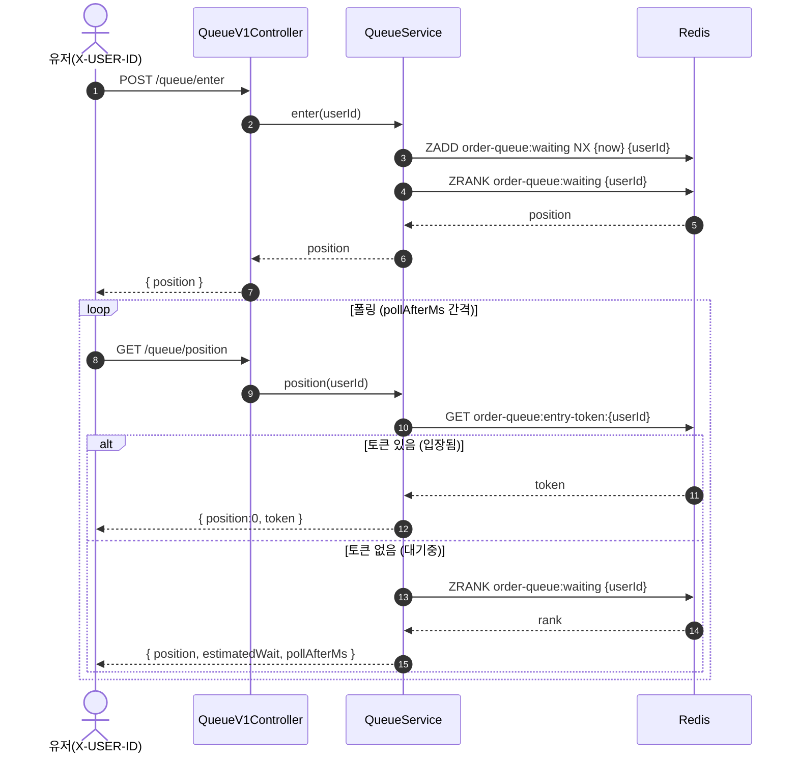
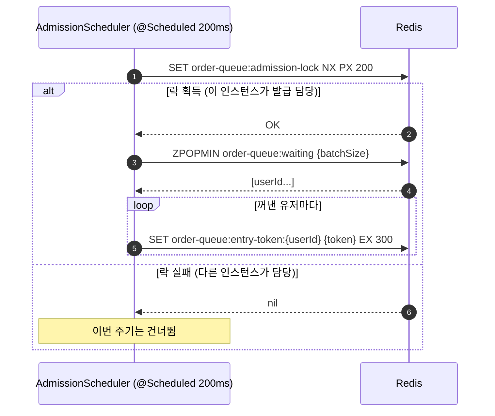
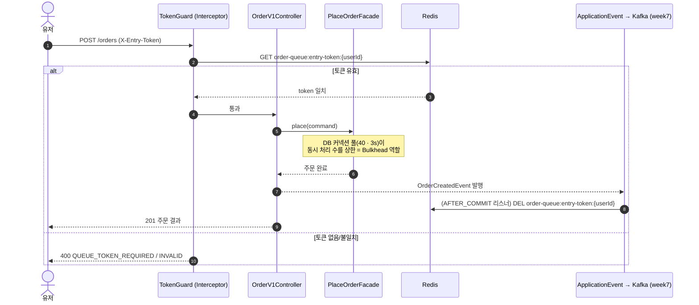

# 시퀀스 다이어그램

세 흐름으로 나눈다. 유저가 겪는 진입·조회, 백그라운드 발급, 그리고 토큰을 든 주문이다. 각 다이어그램 앞에 무엇을 확인하려는지 적는다.

## 1. 진입 & 순번 폴링

무엇을 보려는가 — 진입이 멱등한지(재진입이 순번을 밀지 않는지), 순번 조회가 토큰 발급 여부에 따라 갈리는지를 확인한다.

읽는 법 — 진입은 `ZADD NX` 하나로 끝난다. 이미 줄에 있으면 score가 안 바뀌어 순번이 유지된다. 순번 조회는 먼저 토큰을 확인하고, 있으면 순번 대신 토큰을 준다. **순번 응답이 곧 토큰 전달 경로**라는 게 이 흐름의 핵심이다. 대기열에 아예 없으면(rank가 null) "대기열에 없음"을 반환한다.

## 2. 스케줄러 발급

무엇을 보려는가 — 여러 인스턴스가 돌아도 한 대만 발급하는지, 꺼내기와 발급이 안전하게 이어지는지를 확인한다.

읽는 법 — 유저 요청과 완전히 분리된 백그라운드 흐름이다. 락을 잡은 한 대만 `ZPOPMIN`으로 앞사람부터 꺼내 토큰을 발급한다. `ZPOPMIN`이 원자적이라 설령 락이 없어도 같은 유저가 두 번 꺼내지지는 않는다 — 락은 발급 **속도**를 인스턴스 수만큼 부풀리지 않기 위한 것이다. 락 TTL이 주기와 같아, 담당 인스턴스가 죽어도 다음 주기에 다른 대가 이어받는다.

## 3. 토큰으로 주문

무엇을 보려는가 — 토큰 검증이 주문 처리 앞에 있는지, 동시성 상한을 누가 맡는지, 토큰 삭제가 주문 성공과 어떻게 엮이는지를 확인한다.

읽는 법 — 관문은 **TokenGuard** 한 겹이다: 토큰을 검증해 대기열을 거치지 않은 요청을 차단한다. 동시 처리 상한은 별도 Bulkhead가 아니라 **커넥션 풀(40 · 3s)** 이 맡는다 — 스케줄러가 평균 속도를 눌러도 남는 한 주기 안의 순간 스파이크를, 풀이 동시 40 상한 + 3초 대기로 흡수한다. 토큰 삭제는 주문이 성공했을 때만 일어나야 하므로 검증 시점이 아니라 **주문 성공 이벤트(week7 `OrderCreatedEvent` 재사용)의 AFTER_COMMIT 리스너**로 처리한다. 덕분에 주문 흐름은 대기열을 직접 알지 않는다.

> **대안 — 검증 시 즉시 삭제(consume-on-entry).** 구현은 더 단순하지만, 주문이 실패하면 유저가 토큰을 잃고 다시 줄을 서야 한다. 발제의 "주문 완료 후 삭제"에 맞춰 성공 시 삭제(consume-on-completion)를 택했다.
