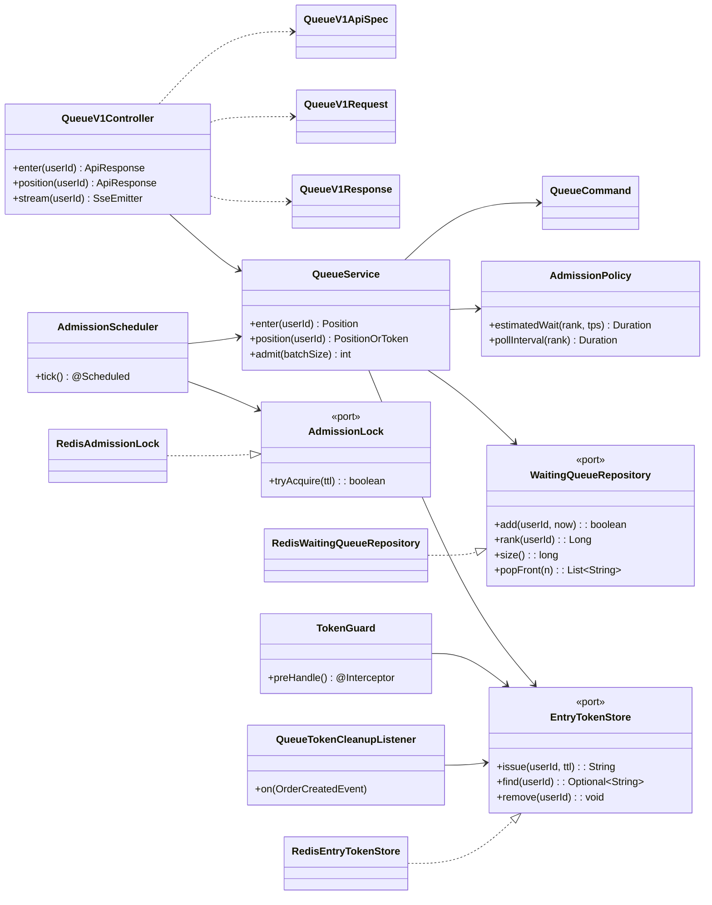

# 클래스 다이어그램 — queue 도메인

무엇을 보려는가 — 계층 간 의존이 안쪽(domain)을 향하는지, 도메인이 I/O를 모르는지(Redis import 없음), 스케줄러·토큰 검증 같은 조율 코드가 어디 앉는지를 확인한다. 기존 `user`·`order` 패키지의 계층 규약을 그대로 따른다.

## 계층 배치

| 계층 | 클래스 | 역할 |
| --- | --- | --- |
| interfaces | `QueueV1Controller`, `QueueV1ApiSpec`, `QueueV1Request`, `QueueV1Response` | REST 입출력. 기존 order 패키지처럼 Request/Response 분리 |
| interfaces | `TokenGuard` | 주문 진입 인터셉터. 토큰 검증만, 삭제는 안 함 |
| application | `QueueService`, `QueueCommand` | enter·position·admit 오케스트레이션 |
| application | `QueueTokenCleanupListener` | 주문 성공 이벤트에서 토큰 삭제(주문↔대기열 디커플링) |
| domain | `AdmissionPolicy` | 예상 대기시간·폴링 간격 계산(순수 규칙) |
| domain | `WaitingQueueRepository`, `EntryTokenStore`, `AdmissionLock` | port 인터페이스. Redis를 모른다 |
| infrastructure | `RedisWaitingQueueRepository`, `RedisEntryTokenStore`, `RedisAdmissionLock` | port의 Redis 어댑터 |
| infrastructure | `AdmissionScheduler` | `@Scheduled` 주기 실행. 락 잡고 `QueueService.admit` 호출 |

## 읽는 법

- **도메인은 I/O를 모른다.** `WaitingQueueRepository`·`EntryTokenStore`·`AdmissionLock`은 domain의 port 인터페이스이고, Redis는 infrastructure의 어댑터에만 등장한다. `AdmissionPolicy`는 순번·TPS만 받아 계산하는 순수 규칙이라 Redis 목 없이 단위 테스트된다.
- **조율은 application·infra에 있다.** `QueueService`는 스스로 결정하지 않고 port를 엮어 유스케이스를 진행한다. `AdmissionScheduler`는 트리거(주기·락)라 infrastructure에 둔다.
- **주문과의 결합을 이벤트로 끊는다.** 토큰 삭제는 `QueueTokenCleanupListener`가 기존 `OrderCreatedEvent`를 받아 처리한다. 주문 코드가 대기열을 import하지 않는다.

## 리스크 & 선택지

- **`AdmissionScheduler`를 어디에 둘까.** 지금은 트리거로 보고 infrastructure에 둔다. 발급 인원 계산(`AdmissionPolicy`)은 domain에 있으니, 스케줄러는 "언제 얼마나"를 조립만 한다. 만약 발급 로직이 커지면 application의 admit 유스케이스로 무게가 옮겨갈 수 있다.
- **`TokenGuard`를 인터셉터로 둘지, 필터/AOP로 둘지.** 인터셉터는 핸들러 매핑 이후라 대상 지정이 쉽다. 인증 필터와 순서가 얽히면 필터로 내려야 할 수 있다.
- **Bulkhead 부착 지점.** 주문 서비스 메서드에 resilience4j 애너테이션으로 건다. 컨트롤러에 걸면 검증 실패까지 상한에 세어질 수 있으니, 검증 통과 뒤 처리 구간에만 걸리도록 위치를 잡는다.
