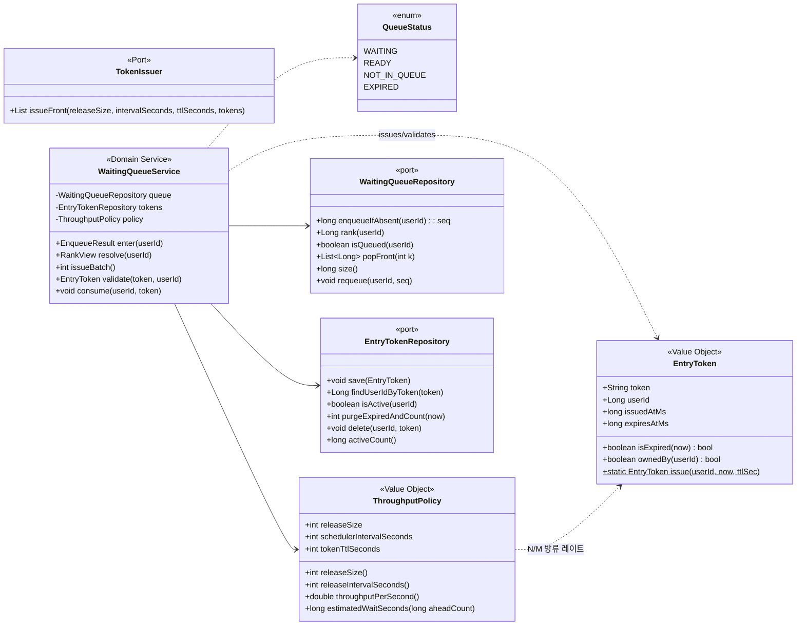
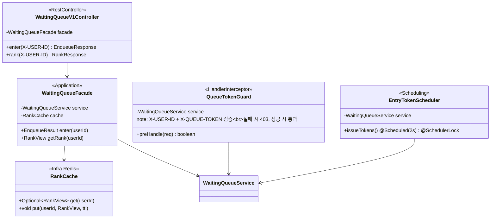
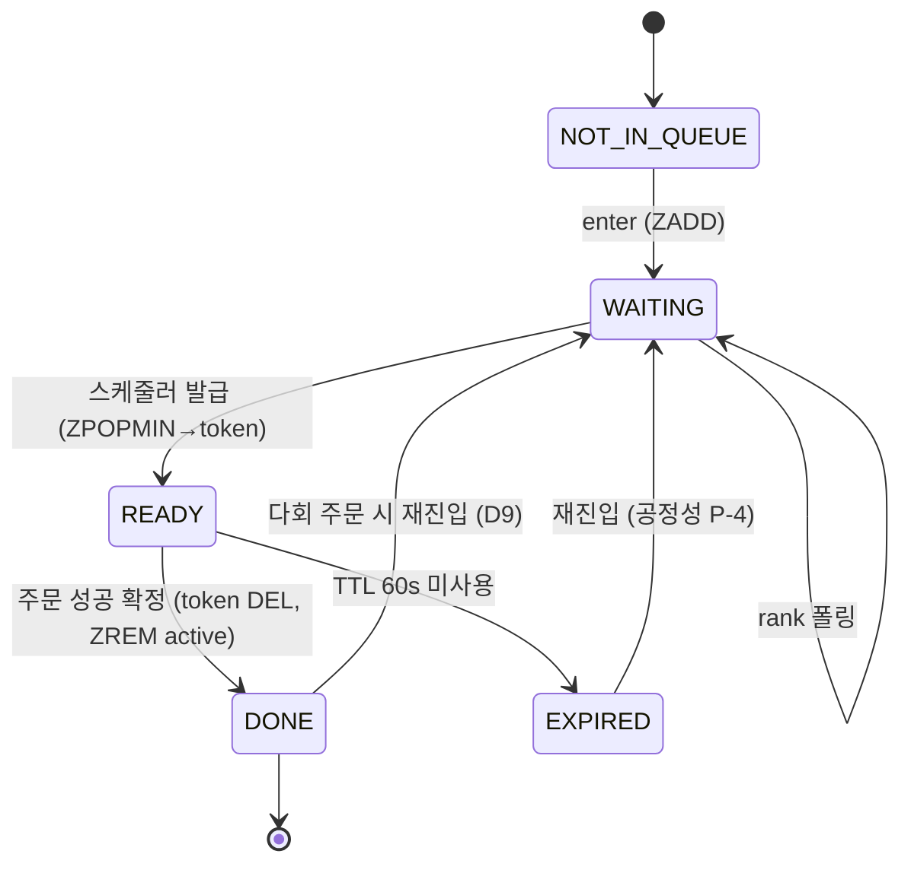

# 03. 클래스 다이어그램 — Redis 기반 대기열 (Virtual Waiting Room)

> **⚠️ 2026-07-08 방류형 전환**: `ThroughputPolicy`의 `dbPoolSize/reserveRatio/avgProcessSeconds`·`maxActive()`·`batchSize()`는 폐기됐다. 현행은 방류형 노브 `releaseSize(N)`·`releaseIntervalSeconds(M)` + `throughputPerSecond()=N/M`. 신규 포트 `TokenIssuer`(구현 `RedisTokenIssuer`, Lua 윈도우 레이트리밋)가 발급 원자성을 담당. 정설은 [`04-redis-model.md`](./04-redis-model.md)·코드.

[`01-requirements.md`](./01-requirements.md) §5 도메인 모델과 [`02-sequence-diagrams.md`](./02-sequence-diagrams.md)의 참여자를 클래스/컴포넌트 수준으로 구체화한다. 이 주차는 **JPA 엔티티가 아니라 Redis 자료구조 + 애플리케이션 컴포넌트**가 중심이므로, 도메인 모델은 값 객체·서비스 위주로 표현한다. Redis 키 상세는 [`04-redis-model.md`](./04-redis-model.md).

## 0. 패키지 배치 (기존 컨벤션 준수)

```
com.loopers
├── interfaces.api.waitingqueue
│   ├── WaitingQueueV1Controller
│   └── dto (EnqueueResponse, RankResponse)
├── interfaces.api.support
│   └── QueueTokenGuard            // HandlerInterceptor, 주문 API에 적용
├── interfaces.scheduling
│   └── EntryTokenScheduler        // @Scheduled + @SchedulerLock(ShedLock)
├── application.waitingqueue
│   ├── WaitingQueueFacade
│   └── dto (EnqueueResult, RankView)
├── domain.waitingqueue
│   ├── WaitingQueueService        // 규칙: 멱등 진입, rank, 토큰 발급/검증/소모
│   ├── EntryToken (VO)
│   ├── QueueStatus (enum)
│   ├── ThroughputPolicy (VO)      // 배치·ETA 산정
│   ├── WaitingQueueRepository     // port
│   └── EntryTokenRepository       // port
├── infrastructure.waitingqueue
│   ├── RedisWaitingQueueRepository   // ZSET(waiting:queue, waiting:seq)
│   ├── RedisEntryTokenRepository     // pass:{token}, user-pass, active:users
│   └── RankCache                     // 순번 결과 단기 캐시(TTL 1~2s)
└── config.waitingqueue
    └── WaitingQueueProperties     // @ConfigurationProperties(prefix="waiting-queue")
```

> 기존 주차 레이어링(interfaces → application(facade) → domain(service+port) → infrastructure(adapter))을 그대로 따른다. Redis 접근은 `RedisTemplate`/`StringRedisTemplate`을 인프라 어댑터에 캡슐화하고, 도메인은 포트만 의존한다.

---

## 1. 도메인 모델



### 값 객체 규칙

- **`EntryToken`** — 불변. `token`은 불투명 문자열(UUID/난수). `isExpired`·`ownedBy`로 가드 검증 로직을 도메인에 둔다(§02 S2-2의 3조건 중 미만료·유저일치). "존재" 여부는 저장소 조회 결과로 판정.
- **`ThroughputPolicy`** — [`01`](./01-requirements.md) §NFR-4·D2의 산식을 코드로 캡슐화. 아래 §3.
- **`QueueStatus`** — 조회 응답의 상태 머신. `WAITING`(대기), `READY`(토큰 발급됨→주문 진행), `NOT_IN_QUEUE`(미진입/취소), `EXPIRED`(토큰 만료).

---

## 2. 애플리케이션·인터페이스 계층



### 책임 경계

- **`WaitingQueueV1Controller`** — HTTP 매핑만. `X-USER-ID` 추출·검증(누락 400/401).
- **`WaitingQueueFacade`** — 유스케이스 조립. 조회 시 `RankCache` 먼저 확인(D5), 미스면 service 호출 후 캐시 적재. ETA 계산은 `ThroughputPolicy`에 위임.
- **`QueueTokenGuard`** — 주문 API(`POST /api/v1/orders`)에만 매핑되는 인터셉터. `WaitingQueueService.validate(token, userId)`로 3조건 검증. **토큰 소모(DEL)는 여기서 하지 않는다** — 주문 성공 확정 후 `OrderFacade`가 `consume()` 호출(D3, 성공 시에만 삭제).
- **`EntryTokenScheduler`** — 발급 배치 진입점. 실행 자체를 ShedLock으로 단일화(NFR-5). 비즈니스는 `service.issueBatch()`에 위임.

> **가드 위치 선택**: `HandlerInterceptor` vs `OncePerRequestFilter`. 인터셉터를 택한 이유 — 특정 핸들러(주문 컨트롤러)에만 경로 매핑하기 쉽고, 이미 인증 컨텍스트(`X-USER-ID`) 이후 단계라 순서 제어가 명확. 필터로 갈 경우 URL 패턴 매칭으로 대체 가능(대안).

---

## 3. ThroughputPolicy — 배치·ETA 산정 (D2 코드화)

[`01`](./01-requirements.md) §NFR-4·§9-D2의 산식을 그대로 반영한다.

```java
// [방류형] 설정값 (WaitingQueueProperties, application.yml: waiting-queue.*)
releaseSize             = 30      // N: 한 주기 방류 인원
schedulerIntervalSeconds= 2       // M: 방류 주기(초)
tokenTtlSeconds         = 30      // D1(개정)

// [방류형] 파생값
releaseSize()          = 30                                   // N
releaseIntervalSeconds()= 2                                   // M
throughputPerSecond()  = releaseSize / intervalSeconds = N/M = 15 (주문/초)
estimatedWaitSeconds(ahead) = ceil(ahead / throughputPerSecond())
// maxActive()/batchSize()는 폐기(활성 상한 gate 없음). 방류량은 Lua 윈도우 예산(N − 윈도우누계)이 결정.
```

> ~~(구설계) `maxActive = floor(dbPoolSize*(1-reserveRatio))`, `batchSize = max(0, maxActive-active)`~~ → 방류형에선 제거. 모든 수치는 `@ConfigurationProperties`로 외부화해 부하테스트로 튜닝(D2). `throughputPerSecond=N/M`은 ETA 계산에 재사용된다. 발급 원자성·다중 인스턴스 안전은 `TokenIssuer`(Lua)가 담당(04 §3.1).

---

## 4. 상태 전이 (유저 관점)



- `WAITING → READY`: 스케줄러가 활성 여유분만큼 pop(§02 S2-1). 유저는 폴링으로 `READY`를 감지(status).
- `READY → EXPIRED`: 60초 내 주문 미호출 → TTL 자동 만료(§02 S2-3). 특혜 없이 큐 뒤로 재진입.
- `READY → DONE`: 주문 성공 확정 시 토큰 소모(D3). 실패는 `READY` 유지(TTL 내 재시도).

---

## 5. 신규/변경 요약

| 구분 | 요소 | 비고 |
| --- | --- | --- |
| 신규 컨트롤러 | `WaitingQueueV1Controller` | enter/rank 2개 엔드포인트 |
| 신규 가드 | `QueueTokenGuard` | 주문 API에만 적용 |
| 신규 스케줄러 | `EntryTokenScheduler` | @Scheduled 2s + ShedLock 재사용 |
| 신규 도메인 | `WaitingQueueService`, `EntryToken`, `ThroughputPolicy`, `QueueStatus` | Redis 규칙 캡슐화 |
| 신규 인프라 | `RedisWaitingQueueRepository`, `RedisEntryTokenRepository`, `RankCache` | Redis 어댑터 |
| **변경** | `OrderFacade`(또는 컨트롤러) | 성공 확정 후 `consume(userId, token)` 1줄 추가 — 그 외 주문 로직 불변(P-6) |
| 재사용 | ShedLock, Redis 인프라, week7 모니터링 | 신규 의존성 없음 |
