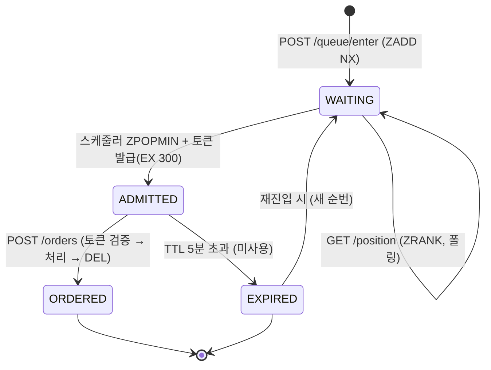

# 상태 다이어그램 — 유저 & 토큰 수명주기

## 왜 이 다이어그램인가

대기열에서 한 유저가 지나는 상태와, 각 전이를 누가 일으키는지를 확인한다. 특히 "만료"라는 갈래가 정상 흐름과 나란히 존재한다는 점 — 토큰을 받고도 안 쓰면 자리를 반납한다는 규칙 — 이 그림에서 드러난다.

## 읽는 법

- **WAITING의 자기 전이**는 순번 폴링이다. 상태는 그대로고 순번만 앞으로 당겨진다. 이 구간에서 유저는 "몇 번째, 약 N분"을 반복해서 본다.
- **WAITING → ADMITTED**는 유저가 아니라 **스케줄러가** 일으킨다. 유저 요청과 무관하게 백그라운드에서 앞사람부터 꺼내 토큰을 발급한다. 유저는 다음 폴링에서 토큰을 받아 자신이 입장했음을 안다.
- **ADMITTED에서 갈래가 둘**이다. 5분 안에 주문하면 ORDERED, 안 하면 EXPIRED. 만료는 실패가 아니라 정상적인 반납이다. 만료된 몫은 스케줄러가 계속 발급하며 다음 유저에게 돌아간다.

## 경계 케이스

- **만료 후 재진입** — 토큰이 만료된 유저가 다시 주문하려면 `enter`로 대기열에 새로 들어온다. 만료가 자동으로 재발급되지는 않는다. 새 순번을 받는다.
- **토큰 보유 중 순번 조회** — ADMITTED 상태에서 `position`을 부르면 순번 대신 토큰을 돌려준다. 순번 응답이 곧 토큰 전달 경로다.
- **주문 후 재주문** — 주문을 마치면 토큰을 `DEL`한다. 같은 유저가 또 주문하려면 토큰이 없으므로 다시 대기열로 들어온다(단발성).
