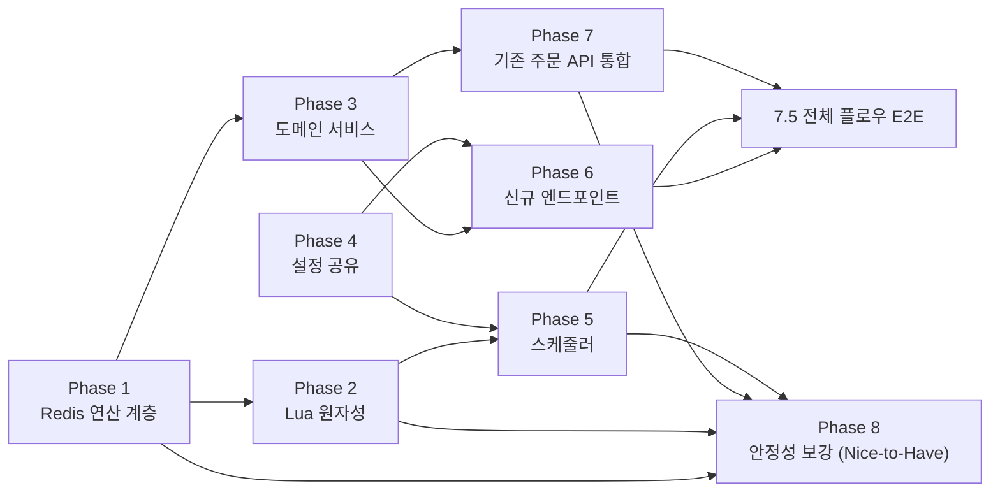

# 대기열 시스템 — 구현 태스크 분해

> [waiting-queue-implementation-plan.md](waiting-queue-implementation-plan.md)의 8단계를 **테스트로 검증 가능한 최소 단위**로 쪼갠 체크리스트입니다. 각 태스크는 산출물(만들/고칠 파일) · 검증(통과시킬 테스트) · 의존(선행 태스크)을 갖습니다. 분해 기준은 하나입니다 — **"이 태스크 하나가 끝났을 때, 그것만으로 통과하는 테스트를 쓸 수 있는가?"**
>
> - 구현 순서·우선순위 근거: [waiting-queue-implementation-plan.md](waiting-queue-implementation-plan.md)
> - 아키텍처·API·코드 구조: [waiting-queue-architecture.md](waiting-queue-architecture.md)
> - 용량·수치 계산: [waiting-queue-capacity-planning.md](waiting-queue-capacity-planning.md)
> - 장애 대응·운영: [waiting-queue-runbook.md](waiting-queue-runbook.md)
>
> Phase 번호는 계획 문서의 "N단계"와 1:1로 대응합니다.

---

## Phase 1 — Redis 연산 계층 (1단계)

- [ ] **1.1** `WaitingQueueRepository` + `WaitingQueueRepositoryImpl`
  - 산출물: `domain/queue/WaitingQueueRepository.java`(`enter`, `rank`, `size`), `infrastructure/queue/WaitingQueueRepositoryImpl.java`
  - 구현 주의: [Redis 키·연산 매핑](waiting-queue-architecture.md#redis-키연산-매핑)에 따르면 `enter()`는 Master 템플릿으로 `ZADD` 실행 직후 같은 Master 템플릿으로 `ZRANK`까지 조회해 그 순번(`Long`)을 반환해야 한다(read-your-own-write). `enter`의 반환형 옆 주석(`// ZADD`)을 "ZADD 원시 반환값(추가된 개수)"으로 오독하지 않도록 주의 — 실제로는 `ZADD` 실행 후 `ZRANK`까지 마친 결과다.
  - 검증: `WaitingQueueRepositoryImplIntegrationTest` (Testcontainers Redis)
    - `enter` 호출 시 0-based 순번을 반환한다
    - 여러 유저가 순서대로 `enter`하면 먼저 들어온 유저의 `rank`가 더 작다
    - 이미 대기열에 있는 유저가 재진입하면 순번이 최신 시각 기준으로 뒤로 밀린다([설계 결정 5번](waiting-queue-architecture.md#5-재진입re-enter-시-동작))
    - `size()`가 `ZCARD`와 일치한다
  - 의존: 없음 (`:modules:redis` testFixtures의 `RedisTestContainersConfig`/`RedisCleanUp` 존재 확인만 선행)

- [ ] **1.2** `EntryTokenRepository` + `EntryTokenRepositoryImpl`
  - 산출물: `domain/queue/EntryTokenRepository.java`(`find`, `delete`), `infrastructure/queue/EntryTokenRepositoryImpl.java`
  - 검증: `EntryTokenRepositoryImplIntegrationTest` (Testcontainers Redis) — 이 시점엔 발급(`issue`) 로직이 아직 없으므로(Phase 2에서 `QueueAdmissionRepository`가 전담) 테스트에서 `RedisTemplate.opsForValue().set(...)`으로 토큰을 직접 세팅한다.
    - 세팅된 토큰이 `find`로 조회된다
    - `delete` 후 `find`는 빈 값(`Optional.empty()`)이다
    - 존재하지 않는 키를 `find`하면 빈 값이다
  - 의존: 없음

---

## Phase 2 — Lua 원자성 (2단계)

- [ ] **2.1** `admit-batch.lua` + `QueueAdmissionRepository` + `QueueAdmissionRepositoryImpl`
  - 산출물: `resources/scripts/admit-batch.lua`, `domain/queue/QueueAdmissionRepository.java`(`AdmittedEntry(Long userId, String token)` record, `admitBatch(int count, Duration tokenTtl)`), `infrastructure/queue/QueueAdmissionRepositoryImpl.java`(`DefaultRedisScript`)
  - 검증: `QueueAdmissionRepositoryImplIntegrationTest` (Testcontainers Redis)
    - N명을 `enter`시켜 둔 뒤 `admitBatch(count)` 호출 시 `min(count, 대기 인원)`명이 반환되고, 각 유저의 토큰이 `EntryTokenRepository.find`로 조회된다
    - `admitBatch`로 뽑힌 유저는 대기열에서 사라진다(`rank`가 더 이상 존재하지 않고 `size()`가 그만큼 줄어든다)
    - 대기열 인원이 `count`보다 적으면 있는 만큼만 반환한다
    - **원자성**: 여러 스레드가 동시에 `admitBatch`를 호출해도 동일 유저가 중복 발급되지 않고, 발급된 유저 총합이 원래 대기 인원과 정확히 일치한다 — "대기열에도 없고 토큰도 없는" 중간 상태가 관측되지 않는지 검증하는 것이 이 태스크의 핵심 목적([근거](waiting-queue-architecture.md#zpopmin과-토큰-발급-사이의-원자성--lua-스크립트))
  - 의존: 1.1, 1.2 (검증 시 두 Repository로 결과를 재확인하므로 존재해야 함. `QueueAdmissionRepositoryImpl` 자체 구현은 두 Repository 구현에 의존하지 않고 `RedisTemplate`을 직접 사용한다)

---

## Phase 3 — 도메인 서비스 (3단계)

- [ ] **3.1** `WaitingQueueService`
  - 산출물: `domain/queue/WaitingQueueService.java` — `enter(Long userId)`가 `Instant.now().toEpochMilli()`를 캡처해 `repository.enter(userId, timestamp)`에 위임, `getRank(Long userId)`/`size()`는 그대로 위임
  - 검증: `WaitingQueueServiceTest` (Repository는 mock) — `any()`/`verify()` 대신 stub 반환값으로 검증(`CLAUDE.md` 테스트 규약)
    - `enter` 호출 시 mock이 반환한 순번을 그대로 반환한다
    - `getRank`/`size`도 mock 반환값을 그대로 반환한다
  - 의존: 1.1 (인터페이스만 있으면 충분, Impl은 필요 없음)

- [ ] **3.2** `EntryTokenService`
  - 산출물: `domain/queue/EntryTokenService.java` — `find(Long userId)`(조회, `Optional<String>`), `verify(Long userId)`(토큰 없으면 `CoreException(ErrorType.FORBIDDEN, "입장 토큰이 없거나 만료되었습니다. 대기열을 통해 다시 진입해주세요.")` — [정확한 메시지 근거](waiting-queue-architecture.md#3-post-apiv1orders--기존-api-수정)), `consume(Long userId)`(`repository.delete` 위임)
  - 검증: `EntryTokenServiceTest` (Repository는 mock)
    - `find`는 mock 반환값을 그대로 반환한다
    - `verify`는 mock이 토큰을 반환하면 예외 없이 통과하고, 빈 값을 반환하면 `CoreException`이 발생하며 `errorType`이 `FORBIDDEN`이다
    - `consume`의 `repository.delete` 위임 자체(void 메서드 상호작용)는 mock 상태 검증으로 확인할 수 없으므로 단위 테스트 범위에서 제외한다 — 실제 삭제 반영 확인은 Phase 7(`OrderFacadeIntegrationTest`)에서 Testcontainers Redis로 검증한다(`CLAUDE.md`: "상호작용 강검증이 필요하면 통합 테스트로 작성한다")
  - 의존: 1.2

---

## Phase 4 — 설정 공유 (4단계)

- [ ] **4.1** `QueueProperties`
  - 산출물: `infrastructure/queue/QueueProperties.java`(`@ConfigurationProperties(prefix = "queue")` record — `schedulerIntervalMs`, `throughputPerSecond`, `batchSize()`). `config/redis` 같은 공용 `config` 패키지가 아니라 `infrastructure/<domain>`에 두는 이유는 이 프로젝트에서 앱(`commerce-api`) 전용 `@ConfigurationProperties`의 기존 유일 사례인 `PaymentGatewayProperties`가 `infrastructure/payment`에 있기 때문(`config/*` 패키지는 `modules/redis`처럼 여러 앱이 공유하는 모듈에서만 쓰는 컨벤션). `commerce-api`의 `application.yml`에 `queue.scheduler-interval-ms: 100`, `queue.throughput-per-second: 70` 추가([근거](waiting-queue-capacity-planning.md#estimatedwaitseconds-계산))
  - 검증: `QueuePropertiesTest` (순수 단위 테스트, Spring 컨텍스트 없이 record 직접 생성)
    - `throughputPerSecond=70`, `schedulerIntervalMs=100`일 때 `batchSize()`가 7이다(계산식: `throughputPerSecond * schedulerIntervalMs / 1000` → 내림)
    - yml → Bean 실제 바인딩 확인은 별도 테스트를 두지 않고 Phase 5(`QueueAdmissionSchedulerIntegrationTest`)에서 실제 주입된 Bean으로 자연히 검증된다
  - 의존: 없음

---

## Phase 5 — 스케줄러 (5단계)

- [ ] **5.1** `QueueAdmissionScheduler` 본체 + gauge
  - 산출물: `application/queue/QueueAdmissionScheduler.java` — `@Scheduled(fixedDelayString = "${queue.scheduler-interval-ms}")`로 `queueAdmissionRepository.admitBatch(queueProperties.batchSize(), ttl)` 호출(`OutboxRelay`와 동일하게 개별 실패는 삼키고 로그, 다음 tick에 재시도), tick 종료 시 `AtomicLong` 갱신 + `MeterRegistry.gauge("queue.scheduler.last.execution.timestamp", ...)` 등록
  - 패키지 위치 참고: 이 프로젝트의 기존 스케줄러 두 개는 위치가 갈린다 — `OutboxRelay`는 `application/outbox`(도메인 계층인 `OutboxService`/`OutboxEventHandler`만 호출), `PaymentReconciliationScheduler`는 `infrastructure/payment`(도메인 `PaymentService`뿐 아니라 상위 계층인 `PaymentFacade`까지 호출). `QueueAdmissionScheduler`는 도메인 인터페이스(`QueueAdmissionRepository`)만 호출하고 상위 계층(Facade)엔 의존하지 않으므로, 의존 방향이 더 깨끗한 `OutboxRelay` 쪽 배치(`application/queue`)를 따른다. 팀 컨벤션상 `infrastructure/queue`를 선호한다면 이 결정은 뒤집어도 무방하다.
  - 검증: `QueueAdmissionSchedulerIntegrationTest` (Testcontainers Redis) — `@Scheduled` 주기(100ms)에 의존하는 비결정적 테스트를 피하기 위해 스케줄러의 실행 메서드를 테스트에서 **직접 호출**한다.
    - N명을 `enter`시켜 둔 뒤 실행 메서드를 호출하면 `batchSize()`만큼만 토큰이 발급되고 대기열에서 빠진다
    - 실행 후 gauge 값(`queue.scheduler.last.execution.timestamp`)이 실행 시각 근접 값으로 갱신된다(`MeterRegistry`에서 직접 조회하거나 Actuator `/actuator/metrics/...` 엔드포인트로 확인)
  - 의존: 2.1(`QueueAdmissionRepository`), 4.1(`QueueProperties`)

- [ ] **5.2** 스레드풀 경합 예방
  - 산출물: `application.yml`에 `spring.task.scheduling.pool.size: 4` 추가([근거](waiting-queue-runbook.md#스케줄러-장애-감지--스레드풀-경합-예방--헬스체크-지표))
  - 검증: **선택/수동** — 설정값 자체는 단위 테스트로 검증할 대상이 없다. `OutboxRelay`(1s)·`PaymentReconciliationScheduler`(5s)·대기열 스케줄러(100ms) 세 스케줄러가 동시에 기동된 상태에서 로그 또는 Actuator로 100ms 주기가 밀리지 않는지 수동 확인한다.
  - 의존: 없음(다른 태스크와 독립적으로 언제든 적용 가능)

---

## Phase 6 — 신규 엔드포인트 (6단계)

- [ ] **6.1** `QueueInfo`
  - 산출물: `application/queue/QueueInfo.java`(record — `position`, `totalWaiting`(nullable), `estimatedWaitSeconds`(nullable), `token`(nullable)), 정적 팩토리 `forEnter(Long rank)`/`forPosition(Long rank, Long size, Long estimatedWaitSeconds, String token)`
  - 검증: `QueueInfoTest` (순수 단위 테스트)
    - `forEnter`는 `totalWaiting`/`estimatedWaitSeconds`/`token`이 모두 `null`이다([DTO 설계 근거](waiting-queue-architecture.md#dto-설계))
    - `forPosition`은 전달된 값이 그대로 채워진다
  - 의존: 없음

- [ ] **6.2** `QueueFacade`
  - 산출물: `application/queue/QueueFacade.java` — `enter(String loginId, String loginPw)`, `getPosition(String loginId, String loginPw)`
  - 검증: `QueueFacadeIntegrationTest` (Testcontainers Redis+MySQL, `@AfterEach`에서 `RedisCleanUp.truncateAll()` + `DatabaseCleanUp.truncateAllTables()`)
    - 실제 유저로 `enter` 호출 시 첫 진입자의 `position`이 0이다
    - 두 유저가 순서대로 `enter`하면 순번이 진입 순서를 반영한다
    - `getPosition`의 `estimatedWaitSeconds`가 `ceil(position / throughputPerSecond)` 공식을 따른다([근거](waiting-queue-capacity-planning.md#estimatedwaitseconds-계산))
    - 토큰이 없으면 `getPosition().token()`이 `null`이고, `EntryTokenRepository`에 직접 토큰을 세팅해두면 `getPosition().token()`에 그 값이 채워진다
  - 의존: 3.1, 3.2, 4.1

- [ ] **6.3** `QueueV1Controller` + `QueueV1Dto` + `QueueV1ApiSpec`
  - 산출물: `interfaces/api/queue/QueueV1Controller.java`, `QueueV1Dto.java`(`EnterResponse`, `PositionResponse` — [DTO 설계](waiting-queue-architecture.md#dto-설계) 그대로), `QueueV1ApiSpec.java`
  - 검증: `QueueV1ApiE2ETest` (`@SpringBootTest(webEnvironment = RANDOM_PORT)` + `TestRestTemplate`)
    - `POST /api/v1/queue/enter` — 200 + `position` 필드
    - `GET /api/v1/queue/position` — 200 + `position`/`totalWaiting`/`estimatedWaitSeconds`/`token` 4개 필드
    - 필수 인증 헤더(`X-Loopers-LoginId`/`X-Loopers-LoginPw`) 누락 시 400
  - 의존: 6.2

- [ ] **6.4** 수동 검증
  - 산출물: `http/commerce-api/queue.http`
  - 검증: **선택/수동** — `enter` → `position` polling → 스케줄러가 토큰을 발급하는 것까지 눈으로 확인. 자동화된 테스트 대상이 아니다.
  - 의존: 6.3, 5.1

---

## Phase 7 — 기존 주문 API 통합 (7단계)

- [ ] **7.1** `ErrorType.SERVICE_UNAVAILABLE`
  - 산출물: `ErrorType`에 `SERVICE_UNAVAILABLE(HttpStatus.SERVICE_UNAVAILABLE, ..., "일시적으로 서비스를 이용할 수 없습니다. 잠시 후 다시 시도해주세요.")` 추가
  - 검증: 단독 테스트 없음(enum 상수 추가) — 7.2의 E2E 테스트에서 함께 검증된다
  - 의존: 없음

- [ ] **7.2** `ApiControllerAdvice` Redis 예외 핸들러
  - 산출물: `ApiControllerAdvice`에 `DataAccessException` 계열 전용 `@ExceptionHandler` 추가(캐치올 `handle(Throwable e)`보다 먼저 매칭되도록 구체 타입 사용)
  - 검증: **선택** — Redis 컨테이너 자체를 테스트에서 끄는 것보다, `@MockBean`으로 대체한 `RedisTemplate`(또는 Repository 구현체)이 `DataAccessException`을 던지도록 설정한 뒤 `QueueV1Controller`/`OrderV1Controller` 호출이 503 + `SERVICE_UNAVAILABLE` 코드로 응답하는지 확인하는 슬라이스 테스트로 작성한다.
  - 의존: 7.1

- [ ] **7.3** `OrderFacade`에 `EntryTokenService` 연동
  - 산출물: `OrderFacade`에 `EntryTokenService` 의존 추가 — `createOrder` 진입 전 `entryTokenService.verify(user.getId())`, 성공 후 `entryTokenService.consume(user.getId())`
  - 검증: 기존 `OrderFacadeIntegrationTest`에 케이스 추가(Testcontainers Redis+MySQL 필요 — 클래스 레벨 Import 확장)
    - 토큰을 미리 세팅해둔 유저는 주문에 성공하고, 성공 후 `EntryTokenRepository.find`로 재조회하면 토큰이 사라져 있다(소비 확인)
    - 토큰이 없는 유저는 `CoreException`이 발생하며 `errorType`이 `FORBIDDEN`이다
  - 의존: 3.2, 기존 `OrderFacadeIntegrationTest`

- [ ] **7.4** `OrderV1Controller` 헤더 추가
  - 산출물: `OrderV1Controller.createOrder`에 `@RequestHeader(AuthHeaders.ENTRY_TOKEN) String entryToken` 파라미터 추가, `AuthHeaders`에 `ENTRY_TOKEN = "X-Loopers-EntryToken"` 상수 추가
  - 검증: 기존 `OrderV1ApiE2ETest`에 케이스 추가
    - 헤더 자체가 없으면 400(`MissingRequestHeaderException`)
    - 헤더는 있지만 토큰이 없거나 만료됐으면 403
  - 의존: 7.3

- [ ] **7.5** 전체 플로우 E2E
  - 산출물: 없음(테스트 전용 태스크)
  - 검증: `QueueV1ApiE2ETest` 또는 별도 `WaitingQueueOrderFlowE2ETest` — `enter` → `position` polling → 토큰 발급 → `POST /orders` 전체 플로우가 200으로 완결된다.
    - 토큰 발급 단계는 `@Scheduled` 타이밍에 의존하지 않도록 **`QueueAdmissionRepository.admitBatch`를 테스트에서 직접 호출**해 결정론적으로 발급시키는 방식을 권장한다. 실제 스케줄러 타이밍까지 검증하려면 Awaitility 도입이 필요하지만 현재 프로젝트엔 미도입 상태이므로 이번 스코프에서는 다루지 않는다.
  - 의존: 7.4, 5.1

---

## Phase 8 — 안정성 보강 (8단계, Nice-to-Have)

핵심 기능(Phase 1~7)이 전부 통과한 뒤에만 시작한다. 설계 문서 스스로 "실측 데이터 없이는 정밀 튜닝 불가"를 명시하고 있어([근거](waiting-queue-runbook.md#장애-감지-및-복구)), 아래 태스크들은 기본값 채택 + 배선(wiring) 확인 수준에 머문다.

- [ ] **8.1** Resilience4j Circuit Breaker
  - 산출물: `application.yml`에 `resilience4j.circuitbreaker.instances.<redis용 인스턴스명>` 블록(기존 `paymentRequest`/`paymentQuery` 패턴 참고), Redis 호출부(Repository 구현체)에 `@CircuitBreaker` 적용
  - 검증: **선택** — 파라미터 자체는 실측 전이라 기본값을 채택하므로 정밀 검증 대상이 아니다. 배선 확인 수준으로, 장애를 유도해(예: mock으로 연속 실패) Open 상태 전환 시 `CallNotPermittedException`이 발생하고 7.2 핸들러가 이를 503으로 변환하는지 정도만 확인한다.
  - 의존: 1.1, 1.2, 2.1, 7.2

- [ ] **8.2** 주문 API Rate Limit
  - 산출물: `OrderV1Controller` 또는 필터 레벨에 Resilience4j `RateLimiter`(문턱값 150 TPS) 적용
  - 검증: **선택/수동** — 짧은 시간 창에 임계치를 초과하는 요청을 보내 초과분이 거부되는지 확인하는 부하성 테스트는 이 테스트 스위트(직렬 실행, Testcontainers 공유)로 안정적으로 재현하기 어렵다. 로컬에서 수동 부하 도구로 확인하는 것을 권장한다.
  - 의존: 없음(기능적으로는 8단계 소속이지만 코드 변경은 독립적)

- [ ] **8.3** Prometheus 알림 규칙 + Grafana 대시보드
  - 산출물: 알림 규칙("마지막 성공 실행으로부터 5~10초 경과"), Grafana 대시보드 정의
  - 검증: 코드 테스트 대상이 아니다. Prometheus/Grafana에 5.1의 gauge 지표가 스크레이핑되는지 수동 확인한다.
  - 의존: 5.1(gauge 지표 존재)

---

## Phase 의존 흐름

- **Must-Have**: Phase 1~7 — 체크리스트(`round8-quests.md`) 충족에 필수.
- **Nice-to-Have**: Phase 8 — 실측 데이터가 쌓이기 전까지는 기본값 배선 확인 수준으로만 진행해도 충분하다.
- 각 Phase의 테스트가 모두 녹색이면 그 Phase는 독립된 PR로 머지할 수 있다. Phase 4는 다른 Phase와 병렬로 언제든 진행 가능하고, Phase 5.2·6.4·8.*는 선택/수동 검증이라 병렬 진행에 제약이 없다.

---

## 다음 논의 항목 (TODO)

- [ ] 실측 데이터(정상 상태 에러율·실제 Redis 호출 TPS·failover 소요 시간) 확보 후 Phase 8 파라미터 재튜닝
