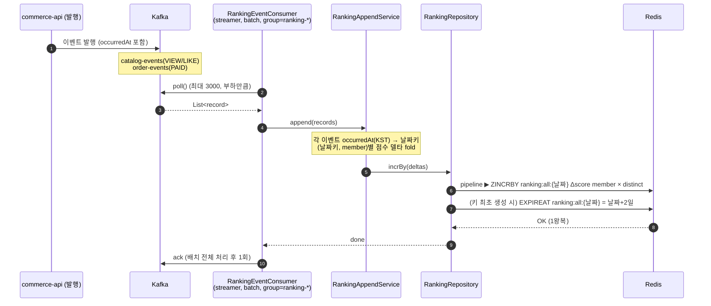
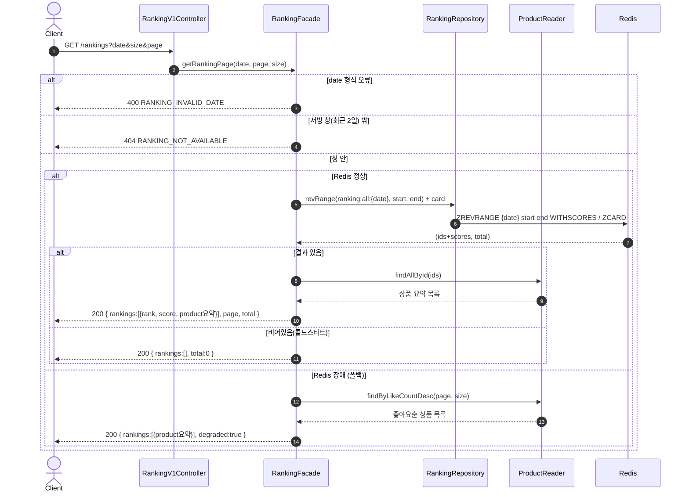
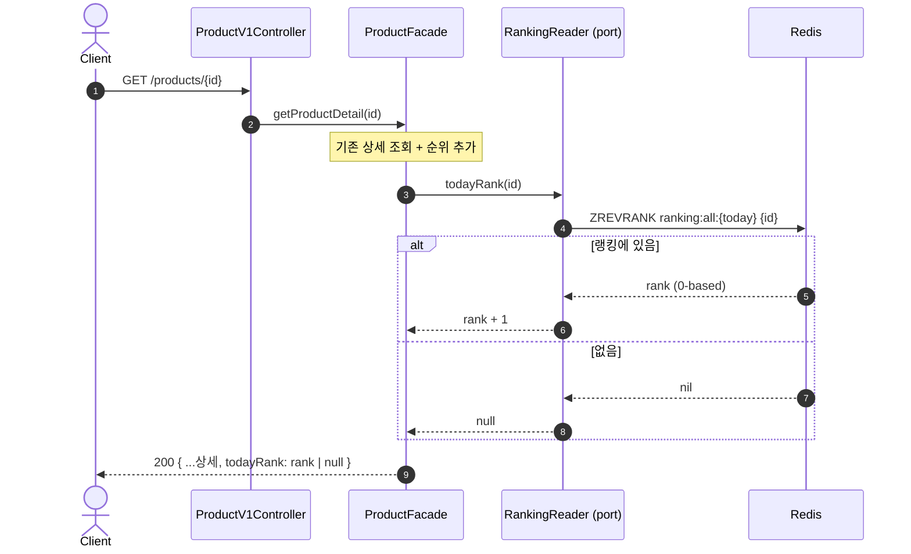

# 시퀀스 다이어그램

Phase 1의 세 흐름을 다룬다. 이벤트로 ZSET을 쌓는 **적재**(streamer), 랭킹 페이지를 주는 **목록 조회**, 상품 상세에 순위를 얹는 **단건 순위**다. Phase 2(carry-over·finalize·재구축)의 흐름은 `01-requirements`의 「콜드 스타트 & 재구축」에서 다룬다. 각 다이어그램 앞에 무엇을 확인하려는지 적는다.

## 1. 적재 — 이벤트 → ZSET (streamer)

무엇을 보려는가 — 대상 키가 **처리시각이 아니라 이벤트 `occurredAt`으로** 정해지는지, 배치를 fold해 pipeline 한 번으로 flush하는지, ack가 배치 뒤 1회인지를 확인한다.

읽는 법 — 대상 키는 이벤트 `occurredAt`을 KST로 끊어 정한다. lag·replay로 늦게 온 13일 이벤트도 `ranking:all:{13일}`에 꽂힌다. 한 배치는 여러 날짜가 섞일 수 있어 fold 키가 `(날짜키, member)`다. fold로 이벤트 수(N)를 distinct 개수로 줄여 pipeline **1왕복**에 보낸다. ack는 배치 뒤 1회 — 실패하면 배치가 재소비돼 `ZINCRBY`가 중복 가산되지만, 랭킹은 근사라 허용한다.

TTL은 **키 최초 생성 시 만료시각을 `날짜+2일`로 고정**한다(`EXPIREAT`). 쓸 때마다 `EXPIRE 2d`로 갱신하면 계속 쓰이는 키의 만료가 뒤로 밀려 영영 안 지워지므로, 상대 TTL이 아니라 절대 만료로 못박는다. VIEW/LIKE는 catalog, PAID는 order — 컨슈머는 토픽별로 나뉘지만 fold·flush 패턴은 동일하다.

## 2. 목록 조회 — 랭킹 페이지 (commerce-api)

무엇을 보려는가 — 서빙 창(최근 2일) 판정으로 400/404/200이 갈리는지, ZSET에서 ID만 뽑아 `findAllById`로 상품정보를 **한 번에** 조합하는지(N+1 회피)를 확인한다.

읽는 법 — 서빙 창 판정이 먼저다. 형식 오류는 400, 창 밖(더 과거·미래) 날짜는 404, 창 안은 200이다. 창 안이지만 아직 점수가 없으면(콜드스타트) **200 빈 목록** — "없는 것"이 아니라 "아직 없는 것"이라 에러가 아니다. ZSET은 `(id, score)`만 주므로, ID 목록을 product 도메인의 `findAllById`로 한 번에 읽어 요약(상품명·가격 등 카드 수준)을 붙인다. `rank`는 `start + index + 1`로 매긴다. 순서는 ZSET이 정렬해 주므로 애플리케이션에서 다시 정렬하지 않는다. Redis 장애로 ZSET 조회가 실패하면 DB `like_count` 내림차순 상품으로 폴백하고 `degraded:true`를 내린다 — 좋아요 수는 DB 컬럼이라 Redis 없이 동작한다. 전체 누적 기반이라 정상 랭킹(일간)과 다르며, flag가 그 차이를 알린다.

## 3. 단건 순위 — 상품 상세 (commerce-api)

무엇을 보려는가 — 상세 조회가 **오늘 키**에 `ZREVRANK`로 순위를 얹는지, 랭킹에 없으면 `null`인지, product가 ranking을 **port로** 참조해 Redis에 직접 붙지 않는지를 확인한다.

읽는 법 — 상세는 **오늘 판**의 순위만 붙인다(과거 날짜 순위는 상세의 관심이 아니다). `ZREVRANK`는 0-based라 +1해 표기하고, 랭킹에 없으면 `null`을 준다. product 도메인은 Redis를 직접 알지 않고 `RankingReader` **port**로 순위를 받는다 — 랭킹 저장소가 바뀌어도 product는 인터페이스만 본다. 순위 조회 실패(Redis 장애 등)는 상세 전체를 막지 않고 `todayRank`만 `null`로 떨구는 선택이 가능하다(상세는 랭킹에 의존하지 않는다).
