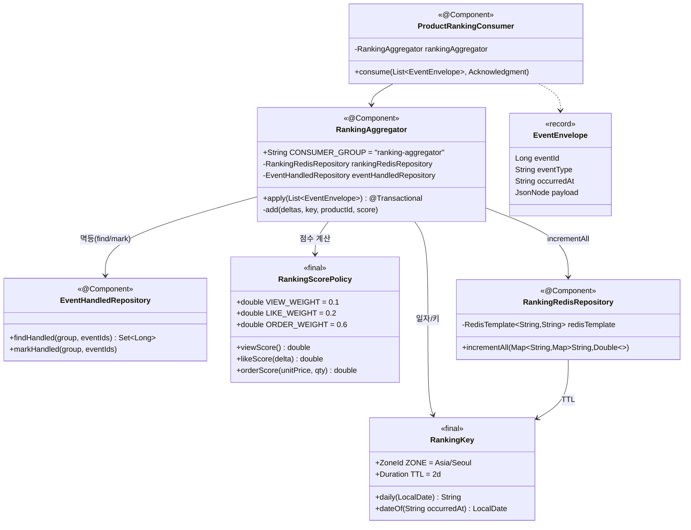
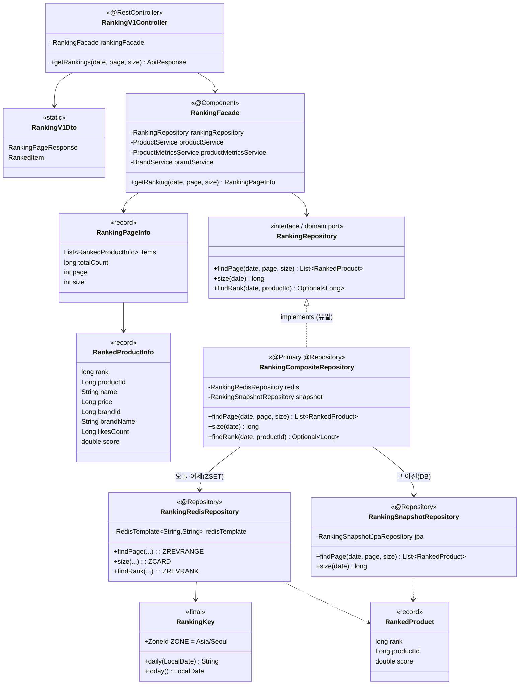
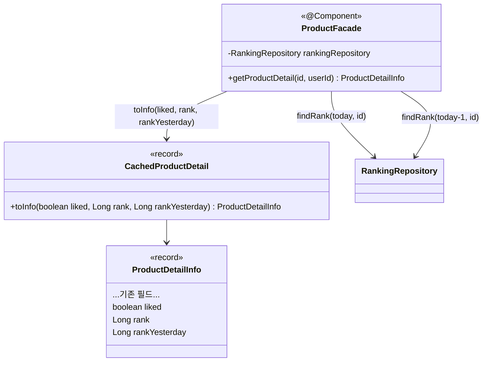

# 03. 클래스 다이어그램 — 실시간 랭킹

랭킹 관련 컴포넌트를 앱별로 정리한다. 두 앱은 코드를 공유하지 않으므로(앱 경계), ZSET 키 포맷은 **문자열 계약**으로만 맞춘다([`04-redis-model.md`](./04-redis-model.md) §1).

- **commerce-streamer** — 적재(쓰기) 측. Kafka Consumer → ZSET.
- **commerce-api** — 조회(읽기) 측. ZSET → Ranking API / 상품 상세.

---

## 1. commerce-streamer (적재/쓰기)

> `EventEnvelope`와 `EventHandledRepository` 모두 week7 `metrics` 패키지의 것을 재사용한다. `EventHandledRepository`는 `consumer_group`을 파라미터로 받도록 설계돼 있어 `ranking-aggregator` 그룹으로 그대로 쓸 수 있다(§2.1). `ProductRankingConsumer`는 `metrics-aggregator`와 **다른 그룹**으로 같은 토픽을 독립 소비하며, `event_handled`도 그룹별 행이라 서로 경합하지 않는다.

---

## 2. commerce-api (조회/읽기) — 레이어드

**레이어드 규칙 준수**

- `domain.ranking.RankingRepository`는 **포트(인터페이스)**, `infrastructure.ranking.RankingCompositeRepository`가 유일한 구현이다 — 도메인은 저장 기술(Redis/DB)도, 데이터가 **어느 소스에서 왔는지도** 모른다. Redis/스냅샷 선택은 인프라 관심사라 포트 뒤에 숨는다.
- `RankingRedisRepository`·`RankingSnapshotRepository`는 포트를 직접 구현하지 않는다 — 컴포지트 뒤의 한쪽 소스일 뿐이다. 소스 선택 규칙(날짜 단위, 혼합 금지)은 [`05-implementation-notes.md`](./05-implementation-notes.md) §2.6.
- `Controller → Facade → Repository(port)` 단방향. Facade가 랭킹(순위·스코어)과 상품 요약을 조립·변환한다.
- API DTO(`RankingV1Dto`)와 응용 DTO(`RankingPageInfo`/`RankedProductInfo`)는 분리.

---

## 3. 상품 상세 순위·추세 통합 (변경분)

> `ProductDetailInfo`/`CachedProductDetail.toInfo`/`ProductV1Dto.ProductDetailResponse`에 `rank`·`rankYesterday` 필드를 추가했다. 둘 다 캐시에 담지 않고 Facade가 매 조회 조합한다(§2.4). 두 순위의 조합으로 상승·하락·신규진입·이탈이 판별된다(§2.5).
