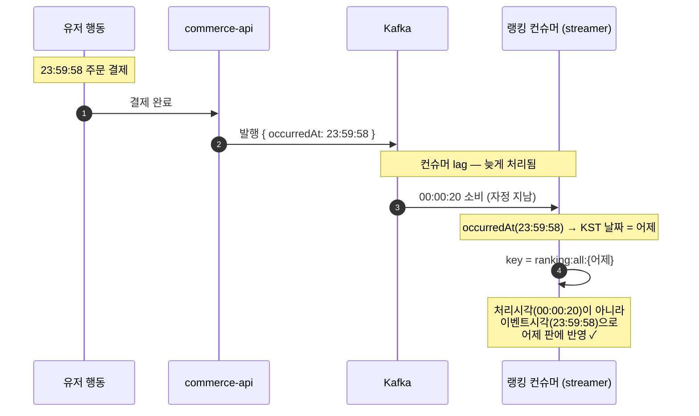
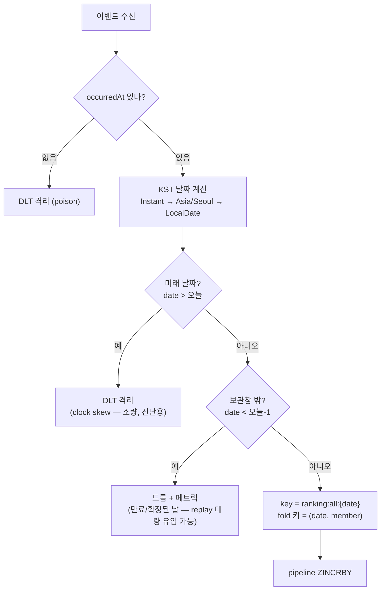

# 이벤트 시각 기반 키 선택 (event-time keying)

랭킹의 대상 키 날짜를 **이벤트가 발생한 시각(`occurredAt`)** 으로 정하는 방식을 정확히 기록한다. 처리시각(consume 시각)으로 정하면 lag·replay로 늦게 도착한 이벤트가 엉뚱한 날 판에 들어가 일간 집계가 오염된다.

## 두 개의 시계를 구분한다

| 시계 | 정의 | 성질 |
| --- | --- | --- |
| **event-time** (`occurredAt`) | 유저 행동이 **실제 일어난** 시각 | 이벤트에 고정. 어느 날 판에 속할지를 정한다 |
| **processing-time** | 컨슈머가 그 이벤트를 **소비한** 시각 | lag만큼 늦다. 키 선택에 **쓰지 않는다** |

핵심: **"어느 날 판인가"는 `occurredAt`으로 결정적으로 정해진다.** 23:59:58 이벤트는 자정을 넘겨 00:00:20에 처리돼도 여전히 어제 판이다.

## 흐름

1. **발행(commerce-api)** — 이벤트 payload에 `occurredAt`을 싣는다. 유저 행동의 실제 시각(주문 결제 시각, 좋아요 토글 시각, 조회 시각)이며, 기존 `OrderPaidMessage.paidAt`과 일관되게 **`ZonedDateTime`** 으로 담는다. order는 `paidAt`을 재사용하고, catalog(`CatalogEventMessage`)에는 `occurredAt` 필드를 추가한다.
2. **전달(Kafka)** — 그대로 실려 간다. 컨슈머가 언제 받든 `occurredAt` 값은 안 변한다.
3. **소비(streamer 랭킹 컨슈머)** — 각 이벤트의 `occurredAt`을 **`Asia/Seoul`** 로 변환해 날짜를 얻고, 그 날짜로 키를 정한다.

```
LocalDate date = occurredAt.withZoneSameInstant(ZoneId.of("Asia/Seoul"))
                           .toLocalDate();
String key = "ranking:all:" + date.format(BASIC_ISO_DATE);   // ranking:all:20260714
```

## 다이어그램 1 — 자정 경계 (핵심 케이스)

무엇을 보려는가 — 자정 직전 이벤트가 자정 넘어 처리돼도 **어제 판**에 반영되는지.



읽는 법 — 컨슈머가 자정을 넘겨 처리했지만 키는 `occurredAt` 기준이라 어제 판으로 간다. 그래서 어제 판은 **자정 이후에도 늦은 이벤트로 계속 갱신**되고, 이것이 스냅샷을 00:00 정각이 아니라 **00:30(grace)** 에 찍는 이유다(늦은 이벤트가 다 들어온 뒤 얼린다).

## 다이어그램 2 — 컨슈머 키 선택 & 가드

무엇을 보려는가 — `occurredAt`이 없거나, 미래거나, 너무 과거(만료·확정된 날)인 이벤트를 어떻게 거르는지.



읽는 법 — 세 가지를 거른다. **누락·미래는 DLT, 너무 과거는 드롭**이다. `occurredAt`이 없으면 버킷을 못 정하므로 **DLT로 격리**(정상 이벤트는 반드시 이 필드를 싣는다는 계약). **미래 날짜**는 producer 시계 오차 신호라 드물어 **DLT로 격리해 진단**한다. **보관창(오늘·어제) 밖의 과거**는 이미 TTL로 만료됐거나 스냅샷으로 확정된 날이라 ZINCRBY하면 **만료된 키를 TTL 없이 되살리는** 문제가 생기고, replay 시 대량 유입될 수 있어 **드롭 + 메트릭**으로 관측한다(DLT에 넣으면 replay 때 폭주).

## 엣지 케이스

| 케이스 | 처리 | 이유 |
| --- | --- | --- |
| `occurredAt` 누락 | **DLT 격리** | 날짜를 못 정함. 정상 이벤트의 필수 필드라 재처리 대상 |
| 미래 날짜(`> 오늘`) | **DLT 격리** | producer 시계 오차 신호. 드물어 DLT에 모아 진단 |
| 너무 과거(`< 오늘-1`) | **드롭 + 메트릭** | 만료·확정된 날이라 못 씀. replay 시 대량 유입될 수 있어 DLT 대신 드롭(폭주 방지), 메트릭으로 관측 |
| producer 시계 skew | (전제) NTP 동기화 가정 | 경계 근처 오차는 소수. 대규모 정밀 요구 시 watermark로 보정(확장) |

## 컨슈머 오프셋 정책 — `latest`

랭킹 컨슈머는 `auto.offset.reset=latest`로 둔다. 이 설정은 **커밋된 오프셋이 없을 때만**(새 그룹 최초 기동, 또는 오프셋 만료) 발동하는 fallback이다. 평상시에는 커밋 지점부터 이어받으므로 이 설정과 무관하다.

| 상황 | 동작 |
| --- | --- |
| 최초 기동(새 그룹) | 지금 이후 새 이벤트만 소비. 과거 히스토리 안 읽음 |
| 평범한 재시작(오프셋 있음) | 커밋 지점부터 이어받음. 건너뜀 없음 |
| 오래 정지 후 복구(오프셋 만료) | 끝으로 점프, 백로그 건너뜀. 랭킹은 근사·일리셋이라 감수 |

`latest`인 이유 — 랭킹은 "지금부터 오늘"만 의미가 있어 과거를 재생할 필요가 없다. 그래서 위 flowchart의 **"너무 과거" 드롭은 정상 운영에선 거의 발동하지 않고**, replay나 심한 lag 같은 예외의 안전망으로만 남는다. `earliest`로 두면 최초 기동 때 토픽 전체 히스토리가 전부 too-old로 흘러들어 낭비다. (정확한 집계가 목적인 `metrics` 컨슈머는 백로그를 건너뛰면 안 되므로 다른 정책을 쓸 수 있다 — 컨슈머를 독립 group으로 둔 이점이다.)

## fold와의 관계

한 배치에는 **서로 다른 날짜**의 이벤트가 섞일 수 있다(자정 경계, replay). 그래서 배치를 접는 fold 키는 단순 `member`가 아니라 **`(date, member)`** 다. fold 후 날짜별 키에 각각 pipeline으로 `ZINCRBY`한다.

```
배치 = [ (101, 어제), (101, 오늘), (202, 오늘) ... ]
fold → { (어제,101): Δ, (오늘,101): Δ, (오늘,202): Δ }
flush → ZINCRBY ranking:all:{어제} Δ 101
        ZINCRBY ranking:all:{오늘} Δ 101
        ZINCRBY ranking:all:{오늘} Δ 202
```
