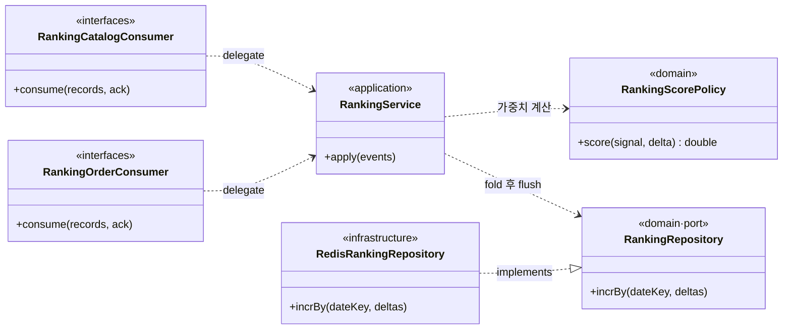
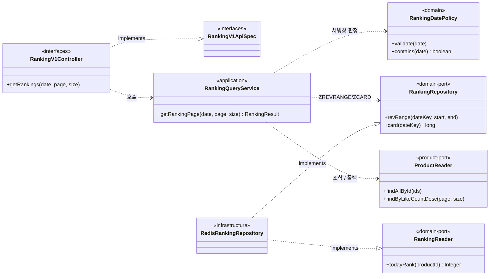

# 클래스 다이어그램 (Phase 1)

랭킹 도메인은 두 앱에 걸친다. **write측(commerce-streamer)** 은 이벤트로 ZSET을 쌓고, **read측(commerce-api)** 은 ZSET을 조회해 상품과 조합한다. 두 앱은 도메인 코드를 공유하지 않으므로(모듈은 도메인 비의존) 각 앱이 자기 `ranking` 패키지를 갖는다. 계층 의존은 안쪽을 향한다: `interfaces → application → domain ← infrastructure`.

Phase 2 클래스(carry-over·finalize 스냅샷·재구축)는 Phase 2 구현 시 다룬다(요구사항은 `01-requirements`의 「콜드 스타트 & 재구축」).

## write측 — commerce-streamer

무엇을 보려는가 — 컨슈머(interfaces)가 fold·점수 계산을 application/domain에 위임하는지, 가중치·키 규칙이 도메인의 순수 정책인지, ZSET 접근이 port 뒤에 있는지.

읽는 법 — 컨슈머는 catalog(VIEW/LIKE)·order(PAID)별로 나뉘고, 각각 **역직렬화만** 하고 `RankingService`에 배치를 넘긴다(metrics의 두 컨슈머 패턴과 동일, 단 group은 `ranking-*`로 독립). `RankingService.apply`가 배치를 `(날짜키, member)`로 fold하며, 이때 **점수는 `RankingScorePolicy`(가중치)** 가 담당한다 — I/O 없는 순수 도메인 정책이라 인프라 목 없이 테스트된다. `occurredAt`→KST 날짜키 계산과 미래/과거 가드(03 문서)는 몇 줄짜리 순수 계산이라 별도 클래스로 올리지 않고 `RankingService` 내부 로직으로 둔다. fold 결과를 `RankingRepository` port로 넘기고, `RedisRankingRepository`가 pipeline `ZINCRBY` + `EXPIREAT`로 flush한다.

> 이벤트 payload에 `occurredAt`이 실려야 한다 — producer(commerce-api)가 발행 시 채운다. 랭킹 컨슈머의 메시지 record(`CatalogEventMessage`/`OrderPaidMessage`)는 이 필드를 포함한다(metrics와 별개 소비라 ranking 패키지에 자체 정의).

## read측 — commerce-api

무엇을 보려는가 — 목록 조회가 Facade 없이 `RankingQueryService` 하나로 ZSET+상품을 조합하는지, 상세는 product가 `RankingReader` port로 순위만 얻는지, Redis 접근이 port 뒤에 있는지.

읽는 법 — `RankingQueryService` 하나가 read 유스케이스를 다 맡는다(Facade 없음). 순서는 ① `RankingDatePolicy`로 서빙창(최근 2일) 판정 → 400/404/200 분기, ② `RankingRepository`로 `ZREVRANGE`/`ZCARD`, ③ `ProductReader.findAllById`로 상품 요약 조합. Redis 장애 시 `ProductReader.findByLikeCountDesc`로 폴백하고 `degraded` 플래그를 붙인다. **상품 상세의 순위**는 반대 방향이다 — product 도메인이 `RankingReader` port의 `todayRank`만 호출해 `ZREVRANK`를 얻는다. product는 랭킹의 read 포트 전체가 아니라 **필요한 단건 순위만** 보는 좁은 인터페이스에 의존한다(인터페이스 분리).

## port 정리

| port | 정의 위치 | 구현 | 사용처 |
| --- | --- | --- | --- |
| `RankingRepository` (write) | streamer/ranking/domain | `RedisRankingRepository` (streamer) | `RankingService` |
| `RankingRepository` (read) | api/ranking/domain | `RedisRankingRepository` (api) | `RankingQueryService` |
| `RankingReader` | api/ranking/domain | `RedisRankingRepository` (api) | product 도메인(상세 순위) |
| `ProductReader` | api/product/domain | product infra | `RankingQueryService`(조합·폴백) |

write측과 read측의 `RankingRepository`는 이름은 같지만 **앱이 달라 별개**이며, 각 앱이 필요한 연산만 가진다(write=증분, read=조회).
