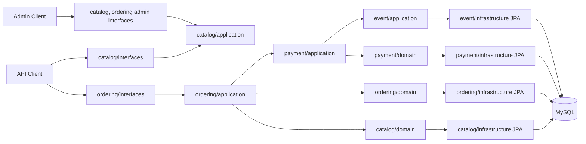
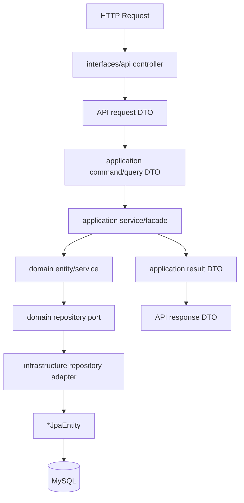
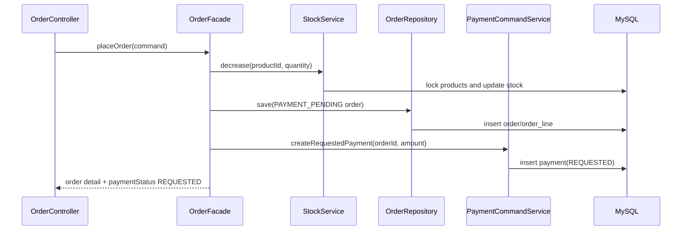
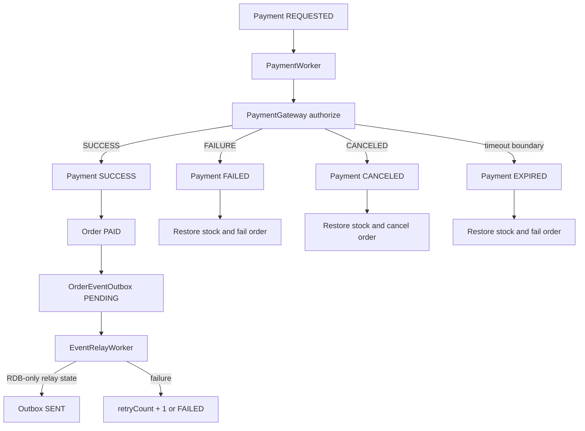

# Week 3 Workflow

이 문서는 3주차 구현 흐름을 빠르게 파악하기 위한 작업자용 흐름도다.
현재 `apps/commerce-api` 범위는 RDB-only이며 Redis, Kafka, cache, message broker 연동은 사용하지 않는다.

## Boundary



## Request Flow



## Order And Payment



## Payment Result



## Catalog

```mermaid
flowchart TD
    ProductList[GET /api/v1/products]
    ProductDetail[GET /api/v1/products/{id}]
    Like[POST /api/v1/products/{id}/likes]
    Unlike[DELETE /api/v1/products/{id}/likes]

    ProductList --> ProductQuery[ProductQueryService]
    ProductDetail --> ProductQuery
    Like --> LikeCommand[ProductLikeCommandService]
    Unlike --> LikeCommand

    ProductQuery --> ProductRepo[ProductRepository]
    ProductQuery --> BrandRepo[BrandRepository]
    ProductQuery --> LikeRepo[ProductLikeRepository]
    LikeCommand --> LikeRepo
    LikeCommand --> ProductRepo

    ProductRepo --> MySQL[(MySQL)]
    BrandRepo --> MySQL
    LikeRepo --> MySQL
```

## Verification

```powershell
$env:JAVA_HOME='C:\Users\woodo\.jdks\ms-21.0.9'
$env:Path="$env:JAVA_HOME\bin;$env:Path"

docker compose -f docker\infra-compose.yml up -d mysql

$env:LOOPERS_TESTCONTAINERS_ENABLED='false'
$env:DATASOURCE_MYSQL_JPA_MAIN_JDBC_URL='jdbc:mysql://localhost:3306/loopers'
$env:DATASOURCE_MYSQL_JPA_MAIN_USERNAME='application'
$env:DATASOURCE_MYSQL_JPA_MAIN_PASSWORD='application'

.\gradlew.bat --no-daemon :apps:commerce-api:test
```

Expected boundary checks:

- `apps/commerce-api` has no Redis/Kafka runtime dependency.
- `apps/commerce-api` does not import `redis.yml` or `kafka.yml`.
- New week-3 domain packages do not depend on Spring, JPA, or HTTP types.
- RDB outbox is the event handoff mechanism for this week.
